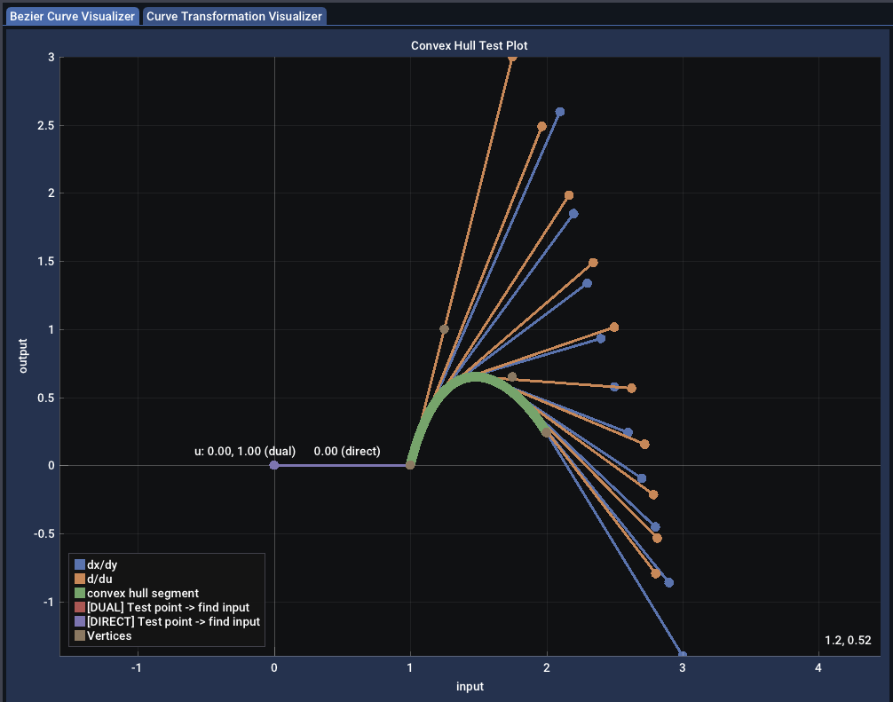

# Wrinkles app - Robust Temporal Math V3 Prototype Project

@TODO: next step is to use the work on Ordinates to define how ranges, and
        times are used to define where a clip sits in the timeline.  IE does a
        media reference describe its media range in integer sample indices?
        Does the clip cut in continuous time?  How does a track describe its
        metric or is that per clip?
        Is the "does the clip cut in continuous time" question analogous to the
        LoD over continuous time in the sampling framework that AAA mentioned?

## Contents

* `treecode`: library for encoding paths through graphs and a `Map` for mapping
  paths to nodes in a graph
* `opentime`: low level points, intervals and affine transforms, and
  `Dual` for doing dual arithmetic/implicit differentiation.  Also includes the
  likely-to-be-deleted `PhaseOrdinate` [^1].
* `curve`: structures and functions for making and manipulating linear and
  bezier splines
* `sampling`: tools for dealing with discrete spaces, particularly sets of either
  samples or sample indices.  Includes tools for transforming and resampling
  such arrays.
* `Mapping`: linear, monontonic, composable transformation functions for
  continuous transformation
* `Topology`: monotonic over their input spaces, use sets of Mappings to
  continuously project from an input space to an output space.
* `ProjectionOperator`: pairs a topology with source and destination references
  which can define discrete spaces so that you can project from a discrete
  space to another discrete space with a continuous transformation in the
  middle.
* `TemporalMap`: tools to transform an editorial document described by
  OpenTimelineIO structures into a temporal hierarchy using the `treecode`
  library.  ProjectionOperators can be built from endpoints in this hierarchy.
* `ProjectionOperatorMap`: decomposes/flattens a TemporalMap from a source
  space such that each segment maps a set of ProjectionOperators to region of
  the source space, mapping media under each section of the output timeline
* `OpenTimelineIO`: structures to represent an editorial timeline document


Structure:

```
                  `opentime`
                      |       \
`treecode`        `sampling`   `curve`
      |              |        /
      \           `Topology`
       \             |
        '----------`ProjectionOperator`
                     |
                  `OpenTimelineIO`
```

Additionally there are tools for visualizing curves, transformations, and the
temporal hierarchies of editorial documents.



## Lessons/Differences to OTIO V1

* clarify that OTIO is modelling a temporally-oriented hierarchy, not a data
  model that necessarily resembles an NLE
* Time is the domain that is handled, so model the structure around time
* transform the data, don't provide a ton of flexibility in the algorithms
  * makes the algorithms simpler and easier to use as templates for
    business-logic specific use cases
* use hierarchy rather than "has-a" to clarify temporal relationships
* having hierarchy object schemas be runtime definable: juice seems not to have
  been worth the squeeze
* explicitly modelling discrete/continuous means no need for rational time
* implementing in a low level language (zig->C) to allow flatter higher level
  language bindings
* explicitly model references into the hierarchy

## Ideal Demonstrator Gui App 8/23

* timeline view
* topological graph node view
* curve projection demonstration app
  * pick curves to project from presets
  * edit / drag points
  * see derivatives
  * see projection result

* app that can open an existing .otio file
* visualize the presentation time-space of the top level track
* tlrender++ scrub around the track and see a render of what the composition
  looks like at that frame decorated with coordinates in the media timespaces
  and media sources for each section/clip
* raven/raven++
* topological view -- for a selection of the document, show the topological
  graph of the temporal structural, decorated with the Transformation curves
  * select two nodes to see the projection operator from one to the other

## Todo List (10/9/25)

* [ ] Can Projection Operator go away?
* [ ] Can the Projection Operator map get melded in with Topology, omitting 
      both the Projection Operator and Operator Map?

## Todo List (11/6/24)

* [x] add build variable for debug messages
* [x] prune existing debug messages out
* [x] clean up how graphviz is found
* [x] decompose opentimelineio.zig into a library w/ multiple modules
* [x] boil time out of opentime (hm might need to rename this library) —
    * [x] particularly ContinuousTimeInterval->ContinuousInterval
    * [x] opentime
* [x] and the rest of the library (notably sampling.zig)
    * [x] sampling
    * [x] ripple out into the c library too
* [x] fold DiscreteDatasourceIndexGenerator into Sampling
    * [x] -> SignalIndexGenerator
    * [x] add more functionality to the DiscreteDatasourceIndexGenerator so that
    * [x] build out into the otio layer too
* [x] rename “time_topology” build unit to “topology”
* [x] `PhaseOrdinate` (or some other means of accurately handling integers over
  rates changing)
    * [x] confirm that this is really better than an `f64` or `f128`
    * ... it isn't, see: [https://github.com/ssteinbach/ordinate_precision_research](https://github.com/ssteinbach/ordinate_precision_research)
* [ ] 0.5 offset todo in sampling
* [ ] thread the "domain" idea out to the discrete spaces, so you can
      define on the timeline a discrete info per domain (ie 24 for picture
      48000 for sound)
* [ ] handle non-integer rates (ie 1000/1001 rates) in the sample rate
* [ ] review the high level tests and make sure they’re covering all the stuff
  in the slides
    * [ ] factor out the code that builds the timelines into a couple
          prototypical timelines, then the tests can operate on those structures
          and make the tests a bit more readable/direct
* [ ] write the slide examples in C
* [ ] handle/test cases where projection results in multiple solutions (maybe
  because inversion creates multiple concurrent topologies?)
* [ ] add a catmull-rom basis function
* [ ] zbez library specific for bezier?
     * [ ] remove the two point/three point approximations and simplify the
           curve library
     * [ ] export bezier code into a zbez library that can be freestanding
* [ ] finish parameterizing the sampling library on type, like the curve
  library
     * ie index_at_time -> output_index_at_input_ordinate
     * [ ] handle acyclical sampling as well (variable bitrate data, held
           frames, etc).?
* [ ] do a scan to make sure that `opentime.Ordinate` is used in place of f32
  directly
* [ ] integrate inside of raven

## Todo List (8/23/24)

* build new gui app
  * visual demonstration application for helping demo concepts
* additional tests/functionality to show the library is capable of handling
  * [ ] cleaning up existing high level tests
  * [ ] arbitrarily held frames
  * [ ] transitions
    * what about NTSC times?
* [x] demonstration c-api
  * [ ] add metadata support
  * [ ] what would a C++ layer look like on top of this?
    * [ ] ...and then what would a Pybind layer on top of the C++/C?
* refactoring core library pieces to clarify/simplify/improve the
  implementation
  * [ ] consistent names
    * replacing `f32` with `opentime.Ordinate`

        ```zig
        pub const Ordinate = struct {
          value : f32,

          pub fn add(self: @This(), rhs: Ordinate) Ordinate{}
          pub fn sub(self: @This(), rhs: Ordinate) Ordinate{}
          pub fn mul(self: @This(), rhs: Ordinate) Ordinate{}
          pub fn div(self: @This(), rhs: Ordinate) Ordinate{}
        };
        ```
    * struct/union with add/mul/div/sub
     * [ ] test_topology_projections.zig
 * [ ]  let brains cool off <- beers

### Bigger, Later Questions/Todos

 * [ ]  what if not beziers internally but instead b-splines with bezier
        interfaces
 * [ ]  rebuild in c?
 * [ ]  PR to OTIO?

## Todo

* domains (how do you handle that you want to evaluate the timeline at 30fps?)
* transitions

### later

* schema design
* `graphviz` viewer for otio files
    * plain format (dot -Tplain) produces a parsable output
    * visualize graph transformations over a topology with different targets
* redesign the `opentimelineio` layer
    * clean up mess of `Item` and `ItemPtr`
    * Allocators should be exposed as parameters, not through `allocator.ALLOCATOR`
    * project_curve and so on should be !TimeCurve, not use catch unreachable
      everywhere
* move to zig v0.11 and bump deps
* topology->[]topology projection (for handling inversions)
* time-varying parameters
* time-varying metadata

## ZIG REFERENCES

* [Zig Lang](https://github.com/ziglang/zig): The language homepage
* [Zig Learn](https://ziglearn.org/chapter-0/): Good starting place for a language overview
* [Language Reference](https://ziglang.org/documentation/master/): Full Language Reference
* [Stdlib Reference](https://ziglang.org/documentation/master/std/#A;std)
* [Stdlib Source](https://github.com/ziglang/zig/tree/master/lib/std): I hate to admit it but often times its faster to just look at the source of the standard lib rather than going through the docs

### DONE

* sampling
## Path System

* support arbitrary path lengths
    * use an array list of u128 to encode arbitrarily long paths
* arbitrary `TopologicalPathHash` lengths
* fix the simple_cut
* JSON OTIO parsing
    * can parse small OTIO files (but because of path length constraints, can't
      build maps for large files)

* Right now the topology has bounds, transform and curves.  This is
  inconsistent because the curves _inside_ the topology also represent a
  transformation, and implicitly define bounds (in that they're finite lists of
  segments, which are bounded).  The math reflects this - the way that
  transform and boundary are applied is pretty inconsistent.

* Part of the reason why this is the case is that there are several special
  cases of topology in play:
    * infinite identity (could have a transform but no bounds)
    * finite segments (do they have bounds?)
    * empty

Two options:

* do what we did for the graph and define a set of operators that bundle up a
  topology and work through the cases, providing clean constructors for those
  useful special types
* break these features up into things that the topology can contain and
  localize the math, push the matrix into handling combinations of those child
  types

* Stacks
* Timeline
* Gap (fully)

* how hard would parsing OTIO JSON be?  Would be cool to read in real
  timeilines and do transformations there

### Inversion

* need to add inversion functions to the topologies
* add error when a function isn't trivially invertible
* if we do something with the mappings, when things aren't trivially
  invertible, we still know how to invert them and how the mapping functions.
  Can we exploit this? Or is the juice not worth the squeeze for this project

### Optimization and Caching

* MxN track related time stuff - the map should cache those kinds of intermediates
* Can the map also cache optimizations like linearizing curves?

### Ordinate Notes

```zig
const Ordinate = union(enum) {
    f32: f32,
    rational: rational,

    // math
    pub fn add() Ordinate {}
    pub fn addWithOverflow() Ordinate {}
    pub fn sub() Ordinate {}
    pub fn subWithOverflow() Ordinate {}
    pub fn mul() Ordinate {}
    pub fn mulWithOverflow() Ordinate {}
    pub fn divExact() Ordinate {}
    pub fn divFloor() Ordinate {}
    pub fn divTrunc() Ordinate {}

    pub fn to_float() f32 {}
};
```

# Memory Management Notes

* The zig pattern has either:
    * `init` and `deinit`: initialize and return a pointer to new memory
    * `create` and `destroy` - create single values in memory and return an 
      `undefined` pointer to the memory.  Equivalent to 
      `var thing : Something = undefined;`, but on the heap.
* we have value types that contain references to memory because they are of
  unknown size - IE "name".  We could fix the size of the name slice, then 
  they would also be fixed value types
* ... but the array types (track, stack, etc) would still need allocations
* if you want the lifetime to extend past the scope, you need to init/deinit
* the `ItemPtr` is definitely a reference type
* I think the questions are:
    * should the containers contain value types?  or reference types?
    * what should users expect from ownership?

## Places for demoing animated parameters on warped scopes

* properties: one time configuration of information (IE, name, temporal
  bounds, media_reference, discrete_info)
* parameters: varying data over some domain (a mapping and an embedding
  domain)

* lens parameters on a clip (ie an animated rack focus or aperture or something)
  * animated focus distance or aperture
* parameter that drives a wipe in a transition
* animating a 2d image space transform 
* a color correct parameter
* state of a gyroscope during capture
* mocap data
    * floats over time

## Why Is This So Complicated

* Editorial Time is Complicated
    * Sometimes Continuous, sometimes discrete
    * Even when its discrete its Complicated
        * different rates/metrics (at the very least, audio vs video)
        * audio rates can be huge, meaning even with not that much wall clock
          time numbers get enormous (ie 192khz - 1 minute of audio is already
          at index 11,520,000, 3.1 hours = max in32)
        * NTSC rates (with a 1001 denominator) mean that mixing rates can be
          difficult to represent with integer rationals
    * Even when its continuous its Complicated
        * Because typically pictures are not resampled, precision is important
        * Audio rates mean that increments can be tiny but still go for large
          ranges
        * when dealing with the media a frame index integer is generally what
          is desired
    * Deformations can be non-linear
        * Bezier curve-based transformations for speed ramps
        * F,M,L type presentations in dailies
        * pulldowns/pullups for going between NTSC and non-NTSC rates
    * Animated parameters are often driven off of time, meaning that time warps
      need to also warp 
* What does OTIO do
    * Uses "RationalTime" - a double value over a double rate.
        * some smarts but used in a handwavvy "both continuous and discrete"
          sort of way
    * Doesn't deal with non-linear transformations
    * Cannot project ranges or points under warp
* What do we propose
    * Join discrete and continuous math via sampling theory

## References

[^1]: [Ordinate Precision Research](https://github.com/ssteinbach/ordinate_precision_research)

