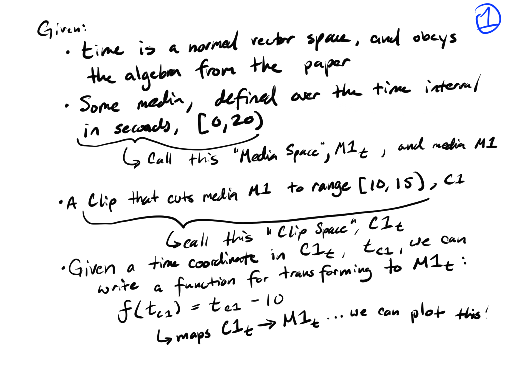
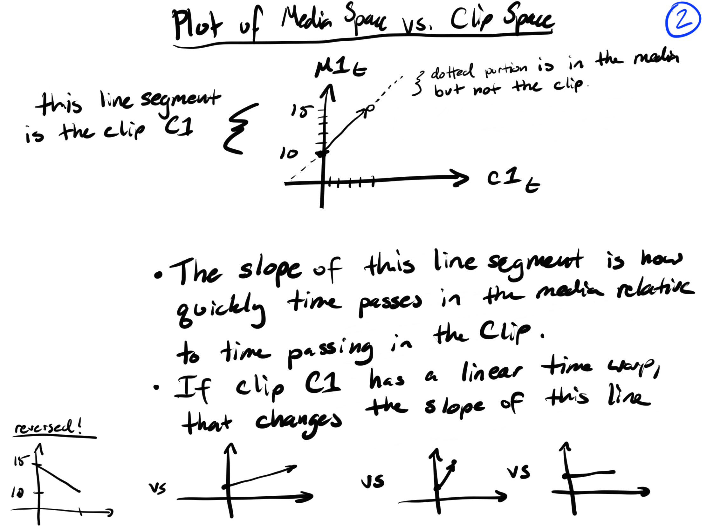
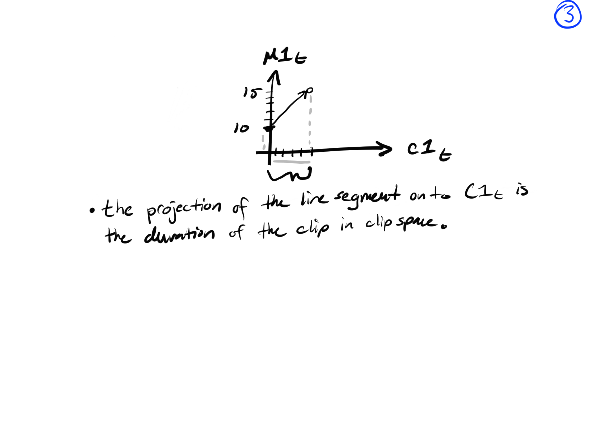
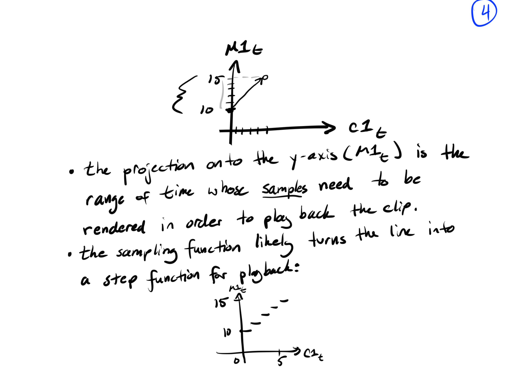
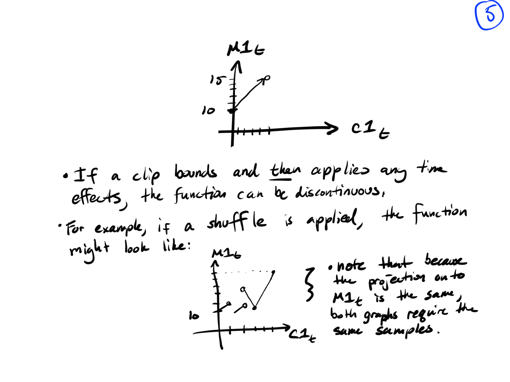
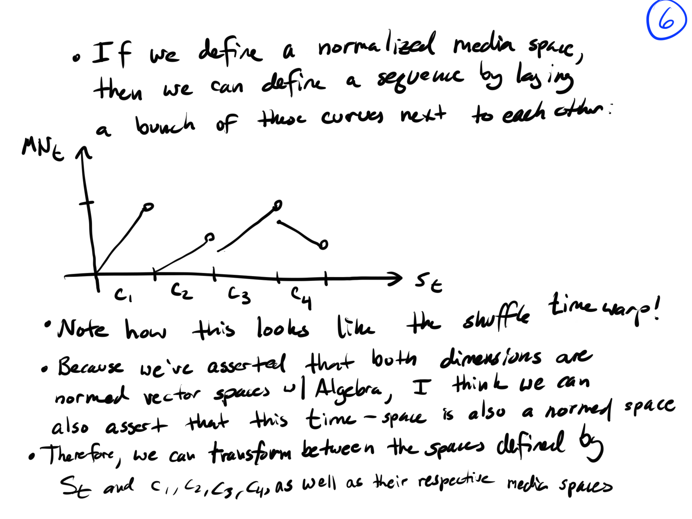

### 1 Feb 2020

### From: Stephan Steinbach

Last night stumbled across:

https://marctenbosch.com/quaternions/

and in thinking about rotators it got me thinking about time mappings. These are my notes from then, apologies for incoherent baby soothing 3:00am thoughts!  Anything interesting in here?

