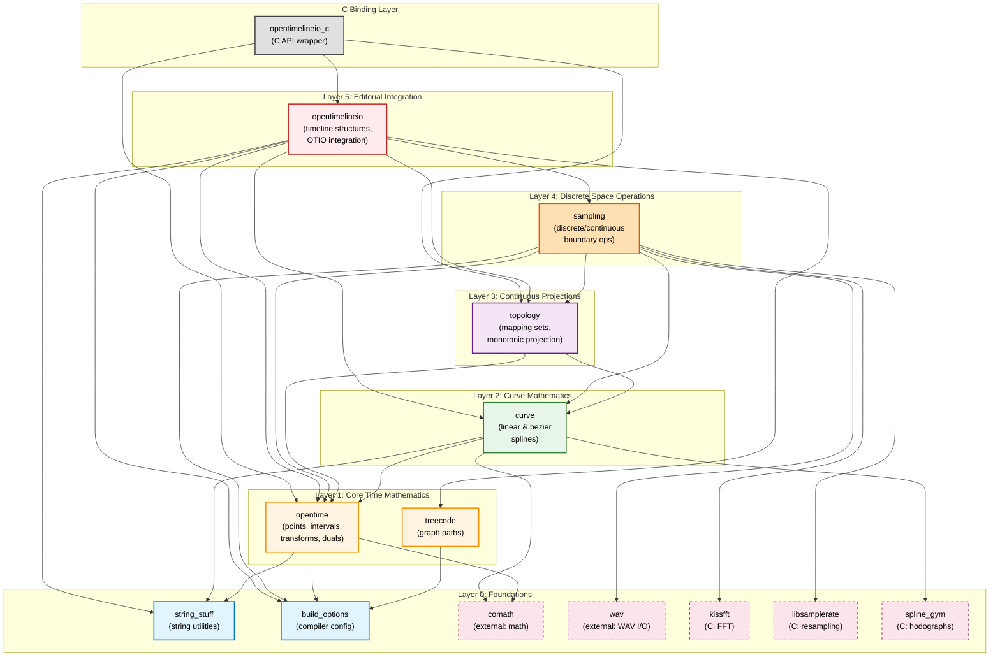

# Source code overview




## Root Structure (26 items)
**Core Build System:**
- `build.zig` (25KB) - Primary Zig build configuration
- `build.zig.zon` - Zig package dependencies
- `Makefile` - Legacy/alternative build system

**Source Code:**
- `src/` - **Main source directory** (explored below)
- `libs/` - External dependencies
- `c_binding/` - C API layer

**Documentation:**
- `README.md` (15.7KB) - Project documentation
- `PROJECTION_TERMS.md` - Terminology definitions
- `notes.md` - Development notes
- `docs/` - Additional documentation

**Data & Examples:**
- `sample_otio_files/` - OpenTimelineIO test data
- `segments/`, `curves/` - Example data
- `spline-gym/`, `wrinkles-book/` - Research/book materials

**Build Artifacts:**
- `zig-out/`, `.zig-cache/` - Build outputs
- `.staging/` - Inception MCP staging area

---

## Source Architecture (`src/` - 23 items)

### Core Library Modules (Directories)
**`opentime/`** - Low-level temporal mathematics
- Points, intervals, affine transforms
- Dual arithmetic for implicit differentiation

**`curve/`** - Spline mathematics
- Linear and bezier curve structures
- Curve manipulation functions

**`sampling/`** - Discrete space handling
- Sample/index set operations
- Transformation and resampling

**`topology/`** - Continuous projection framework
- Mapping sets for space transformation
- Monotonic projection operations

**`treecode/`** - Graph path encoding
- Path encoding through graphs
- Map structure for graph navigation

**`opentimelineio/`**
- Editorial document structures
- Timeline representation
- OTIO integration layer

### Primary Implementation Files
**Core Systems:**
- `wrinkles.zig` (16KB) - Main application orchestration
- `wrinkles_visual_debugger.zig` (24KB) - Visual debugging interface
- `transformation_visualizer.zig` (15KB) - Transformation visualization
- `sampling.zig` (64KB) - **Largest module** - discrete space operations
- `curvet.zig` (74KB) - **Largest module** - curve operations

**OTIO Integration:**
- `otio_measure_timeline.zig` - Timeline measurement
- `otio_dump_graph.zig` - Graph visualization output

**Graphics/UI:**
- `wrinkles_*.wgsl` (WGSL shaders) - WebGPU shader programs
- `blank_fs.wgsl` - Fragment shader
- `example_zgui_app.zig` - Dear ImGui example
- `sokol_test.zig` - Sokol graphics testing

**C Binding Layer:**
- `c_binding/` - C API wrapper for library functions

---

## Architectural Assessment

**Language**: Zig (primary) with C bindings and WGSL shaders

**Pattern**: Library-first design with layered dependencies matching the README diagram:
```
opentime → sampling/curve
    ↓           ↓
  treecode → topology → ProjectionOperator → OpenTimelineIO
```

**Scale**: ~190KB of core Zig code across ~23 files, with heavy concentration in curve and sampling modules.

**Purpose**: Research prototype exploring temporal mathematics at the continuous/discrete boundary for editorial timeline applications.

