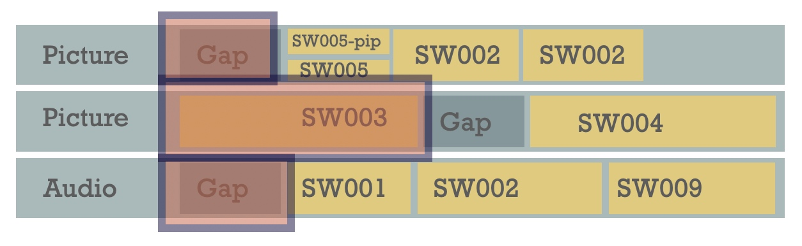

# Wrinkles in Time
## Stephan Steinbach & Nick Porcino
Pixar Animation Studios, 2025

## Preface

The genesis of this work was our frustration with inconsistencies in the outcomes of simple temporal operations across different media composition systems. Operations that should produce identical results between systems often didn't, creating unpredictable workflows for artists and engineers alike. We started out with the idea that we could just spend a couple of weeks and create a simple library of functions for computations on time for digital media that could introduce consistency to the development landscape. It quickly became apparent than the problem was harder than we thought.

What we thought might take weeks became a years-long exploration. We discovered that while time is fundamental to media composition—where video clips at different frame rates must synchronize with audio at independent sampling rates—there was surprisingly little literature providing a comprehensive mathematical treatment of temporal operations. We decided to take a step back, and try to derive a mathematical framework from first principles.

We began by following Euclid's approach in Elements, starting with a point in time conceptualized as an infinite half-space dividing past from future, and derived a geometry of time. The rest of the framework followed, treating time as a normed vector space subject to mathematical operations, coordinate systems, and affine transformations to temporal topology and sampling theory, ultimately creating a unified model that represents the complete cycle of temporal transformations in media from capture to presentation. This book reflects that journey, providing both the theoretical foundations and practical applications of our time algebra in real-world systems like OpenTimelineIO.

We are pleased to present 'Wrinkles in Time' as a guide to your own exploration of time in media composition, and hope that the framework presented here will bring consistency, precision, and new creative possibilities to the next generation of media creation tools.

# Table of Contents - Wrinkles in Time

## Preface
- [Genesis of the work](wrinkles-in-time.md#preface)
- [Authors' journey](wrinkles-in-time.md#preface)
- [Purpose and scope](wrinkles-in-time.md#preface)

## Introduction
- [Time in Media Composition Systems](wrinkles-in-time.md#time-in-media-composition-systems)
- [Historical Context](wrinkles-in-time.md#historical-context)
- [The Current Challenge](wrinkles-in-time.md#the-current-challenge)
- [A New Approach](wrinkles-in-time.md#a-new-approach)

## Chapter 1: Media Composition Time Challenges
- [The Problem of Multiple Temporal Rates](wrinkles-in-time.md#the-problem-of-multiple-temporal-rates)
- [Today's Conform-Based Workflow](wrinkles-in-time.md#todays-conform-based-workflow)
- [Problems with the Conform-Based Approach](wrinkles-in-time.md#problems-with-the-conform-based-approach)
- [Tomorrow's Natural-Rate Based Workflow](wrinkles-in-time.md#tomorrows-natural-rate-based-workflow)
- [Benefits of the Natural-Rate Approach](wrinkles-in-time.md#benefits-of-the-natural-rate-approach)

## Chapter 2: Domains of Time
- [The Wheel of Creation](wrinkles-in-time.md#the-wheel-of-creation)
- [The Production Loop](wrinkles-in-time.md#the-production-loop)
  - [Narrative Time](wrinkles-in-time.md#narrative-time)
  - [Capture Time](wrinkles-in-time.md#capture-time)
  - [Media Time](wrinkles-in-time.md#media-time)
  - [Composition Time](wrinkles-in-time.md#composition-time)
  - [Presentation Time](wrinkles-in-time.md#presentation-time)
  - [Observation Time](wrinkles-in-time.md#observation-time)
  - [Participation Time](wrinkles-in-time.md#participation-time)
  - [Generation Time](wrinkles-in-time.md#generation-time)
  - [Reification Time](wrinkles-in-time.md#reification-time)
  - [Rendering Time](wrinkles-in-time.md#rendering-time)
- [The Real-Time Loop](wrinkles-in-time.md#the-real-time-loop)
- [Relationships Between Domains](wrinkles-in-time.md#relationships-between-domains)

## Chapter 3: Mathematical Foundations of Time
- [From First Principles](wrinkles-in-time.md#from-first-principles)
- [Define a Metric Space](wrinkles-in-time.md#define-a-metric-space)
- [Time as an Ordinate and Separating Plane](wrinkles-in-time.md#time-as-an-ordinate-and-separating-plane)
- [Intervals](wrinkles-in-time.md#intervals)
- [Coordinate Systems & Topology](wrinkles-in-time.md#coordinate-systems--topology)
  - [Interval Algebra](wrinkles-in-time.md#interval-algebra)
  - [Affine Transformations](wrinkles-in-time.md#affine-transformations)
  - [Change of Basis Transformation](wrinkles-in-time.md#change-of-basis-transformation)
- [Normed Vector Spaces & Intervals](wrinkles-in-time.md#normed-vector-spaces--intervals)
- [Time Algebra Elements and Operations](wrinkles-in-time.md#time-algebra-elements-and-operations)

## Chapter 4: Temporal Topology
- [A Tree, In Not So Many Bits](wrinkles-in-time.md#a-tree-in-not-so-many-bits)
- [Synchronous and Sequential Elements](wrinkles-in-time.md#synchronous-and-sequential-elements)
- [Sync/Seq Make a Tree](wrinkles-in-time.md#syncseq-make-a-tree)
- [Encode as a Succinct Bitstream](wrinkles-in-time.md#encode-as-a-succinct-bitstream)
- [Every Node Has a Unique Identifier](wrinkles-in-time.md#every-node-has-a-unique-identifier)
- [Topology Changes Change the Bits](wrinkles-in-time.md#topology-changes-change-the-bits)
- [Benefits of Topological Representation](wrinkles-in-time.md#benefits-of-topological-representation)
- [Topology vs. Coordinate Systems](wrinkles-in-time.md#topology-vs-coordinate-systems)
- [Applying Topology in Editorial Systems](wrinkles-in-time.md#applying-topology-in-editorial-systems)

## Chapter 5: Projection through a Topology
- [Time, From a Certain Point of View](wrinkles-in-time.md#time-from-a-certain-point-of-view)
- [Applications of Temporal Projection](wrinkles-in-time.md#applications-of-temporal-projection)
- [Foundations of Temporal Projections](wrinkles-in-time.md#foundations-of-temporal-projections)
- [Embedding Time Mappings in a Topology](wrinkles-in-time.md#embedding-time-mappings-in-a-topology)
  - [Properties of the Temporal Mapping Domain](wrinkles-in-time.md#properties-of-the-temporal-mapping-domain)
- [Measuring Time Across Discontinuous Intervals](wrinkles-in-time.md#measuring-time-across-discontinuous-intervals)
  - [Boundary Constraints in Projection](wrinkles-in-time.md#boundary-constraints-in-projection)
- [The Unit Identity Interval](wrinkles-in-time.md#the-unit-identity-interval)
- [The Nature of Topology Projection](wrinkles-in-time.md#the-nature-of-topology-projection)
  - [An Example](wrinkles-in-time.md#an-example)
- [Boundary Constraints](wrinkles-in-time.md#boundary-constraints)
- [Advanced Projections and Complex Topologies](wrinkles-in-time.md#advanced-projections-and-complex-topologies)
- [Non-Analytical Compositions through Approximation](wrinkles-in-time.md#non-analytical-compositions-through-approximation)
- [Practical Application: Composing Complex Functions](wrinkles-in-time.md#practical-application-composing-complex-functions)
- [Summary](wrinkles-in-time.md#summary)
- [About the Title](wrinkles-in-time.md#about-the-title)

## Chapter 6: Sampling Theory
- [In Which, The Rubber Hits The Road](wrinkles-in-time.md#in-which-the-rubber-hits-the-road)
- [The Continuous-Discrete Duality](wrinkles-in-time.md#the-continuous-discrete-duality)
  - [The Fundamental Challenge](wrinkles-in-time.md#the-fundamental-challenge)
  - [Definition of a Sampling](wrinkles-in-time.md#definition-of-a-sampling)
- [Sampling Functions in Time Algebra](wrinkles-in-time.md#sampling-functions-in-time-algebra)
  - [Mathematical Representation](wrinkles-in-time.md#mathematical-representation)
  - [Frequency Domain Perspective](wrinkles-in-time.md#frequency-domain-perspective)
- [Manipulating Samplings Through Projection](wrinkles-in-time.md#manipulating-samplings-through-projection)
  - [Transforming the Mapping, Not the Content](wrinkles-in-time.md#transforming-the-mapping-not-the-content)
  - [Remapping Example: Time Stretching](wrinkles-in-time.md#remapping-example-time-stretching)
  - [The Role of Phase in Sampling](wrinkles-in-time.md#the-role-of-phase-in-sampling)
- [Frame Kernels and Reconstruction](wrinkles-in-time.md#frame-kernels-and-reconstruction)
  - [The Frame Kernel Concept](wrinkles-in-time.md#the-frame-kernel-concept)
  - [Reconstruction of Continuous Signals](wrinkles-in-time.md#reconstruction-of-continuous-signals)
- [Resampling Techniques](wrinkles-in-time.md#resampling-techniques)
  - [Fetching New Samples](wrinkles-in-time.md#1-fetching-new-samples)
  - [Resampling with Convolution](wrinkles-in-time.md#2-resampling-with-convolution)
- [Continuous Parametric Sampling](wrinkles-in-time.md#continuous-parametric-sampling)
  - [Parametric Spaces and Worldlines](wrinkles-in-time.md#parametric-spaces-and-worldlines)
  - [Uniform Parametrization and Sampling Strategies](wrinkles-in-time.md#uniform-parametrization-and-sampling-strategies)
  - [Bridging Parametric and Temporal Spaces](wrinkles-in-time.md#bridging-parametric-and-temporal-spaces)
  - [Implications for Media Systems](wrinkles-in-time.md#implications-for-media-systems)
  - [Connecting to Topological Projection](wrinkles-in-time.md#connecting-to-topological-projection)
- [Practical Example: Retiming a Mixed Media Composition](wrinkles-in-time.md#practical-example-retiming-a-mixed-media-composition)
- [The Sampling Topology](wrinkles-in-time.md#the-sampling-topology)
  - [Continuous Representation of Discrete Samples](wrinkles-in-time.md#continuous-representation-of-discrete-samples)
  - [Transformations on Sampling Topologies](wrinkles-in-time.md#transformations-on-sampling-topologies)
- [Interpolation as Continuous Mapping](wrinkles-in-time.md#interpolation-as-continuous-mapping)
  - [Continuous Representation Through Interpolation](wrinkles-in-time.md#continuous-representation-through-interpolation)
  - [Interpolation Methods in Temporal Context](wrinkles-in-time.md#interpolation-methods-in-temporal-context)
- [Temporal Aliasing and Nyquist Limits](wrinkles-in-time.md#temporal-aliasing-and-nyquist-limits)
  - [The Nyquist-Shannon Sampling Theorem](wrinkles-in-time.md#the-nyquist-shannon-sampling-theorem)
  - [Dealing with Temporal Aliasing](wrinkles-in-time.md#dealing-with-temporal-aliasing)
- [The Sampling Function Taxonomy](wrinkles-in-time.md#the-sampling-function-taxonomy)
  - [Types of Sampling Functions](wrinkles-in-time.md#types-of-sampling-functions)
  - [Sampling Function Composition](wrinkles-in-time.md#sampling-function-composition)
  - [Coordinate Systems and Sampling](wrinkles-in-time.md#coordinate-systems-and-sampling)
  - [Topology and Sampling](wrinkles-in-time.md#topology-and-sampling)
  - [Projection and Sampling](wrinkles-in-time.md#projection-and-sampling)
- [Practical Example: SMPTE Timecode](wrinkles-in-time.md#practical-example-smpte-timecode)
  - [The Dual Nature of Timecode](wrinkles-in-time.md#the-dual-nature-of-timecode)
  - [Drop Frame vs. Non-Drop Frame: Timecode Compensation](wrinkles-in-time.md#drop-frame-vs-non-drop-frame-timecode-compensation)
  - [Historical Significance and Limitations](wrinkles-in-time.md#historical-significance-and-limitations)
  - [Revisiting SMPTE Timecode with Sampling Theory](wrinkles-in-time.md#revisiting-smpte-timecode-with-sampling-theory)
  - [From SMPTE to Temporal Algebra: A Path Forward](wrinkles-in-time.md#from-smpte-to-temporal-algebra-a-path-forward)
  - [Implementation Considerations](wrinkles-in-time.md#implementation-considerations)
- [Summary](wrinkles-in-time.md#summary-1)

## Chapter 7: Interactive Timelines
- [Indeterminancy, Observability, Many Worlds](wrinkles-in-time.md#indeterminancy-observability-many-worlds)
- [The Nature of Indeterminancy](wrinkles-in-time.md#the-nature-of-indeterminancy)
  - [The Messy Middle](wrinkles-in-time.md#the-messy-middle)
  - [Temporal Mapping of Indeterminate Intervals](wrinkles-in-time.md#temporal-mapping-of-indeterminate-intervals)
- [Multiple Temporal Domains](wrinkles-in-time.md#multiple-temporal-domains)
  - [The Layered Nature of Time in Interactive Media](wrinkles-in-time.md#the-layered-nature-of-time-in-interactive-media)
  - [Mapping Between Temporal Domains](wrinkles-in-time.md#mapping-between-temporal-domains)
  - [Temporal Domains in Practice](wrinkles-in-time.md#temporal-domains-in-practice)
  - [Indeterminancy Across Domains](wrinkles-in-time.md#indeterminancy-across-domains)
- [Observability](wrinkles-in-time.md#observability)
  - [The Collapse of Possibilities](wrinkles-in-time.md#the-collapse-of-possibilities)
  - [Handling Indeterminancy in Media Systems](wrinkles-in-time.md#handling-indeterminancy-in-media-systems)
- [Quantum Electrodynamics and Temporal Indeterminancy](wrinkles-in-time.md#quantum-electrodynamics-and-temporal-indeterminancy)
  - [Feynman's Perspective on Time](wrinkles-in-time.md#feynmans-perspective-on-time)
  - [Sum Over Histories](wrinkles-in-time.md#sum-over-histories)
  - [Temporal Entanglement](wrinkles-in-time.md#temporal-entanglement)
  - [Projection as Quantum Transformation](wrinkles-in-time.md#projection-as-quantum-transformation)
- [Physics Simulation in Temporal Algebra](wrinkles-in-time.md#physics-simulation-in-temporal-algebra)
  - [Bridging Simulation and Rendering Time Domains](wrinkles-in-time.md#bridging-simulation-and-rendering-time-domains)
- [Many Worlds](wrinkles-in-time.md#many-worlds)
  - [Branching Temporal Structures](wrinkles-in-time.md#branching-temporal-structures)
  - [Extending the Algebra to Graphs](wrinkles-in-time.md#extending-the-algebra-to-graphs)
  - [Projections Across Possible Worlds](wrinkles-in-time.md#projections-across-possible-worlds)
- [Applications to Interactive Media](wrinkles-in-time.md#applications-to-interactive-media)
  - [Real-time Interactive Systems](wrinkles-in-time.md#real-time-interactive-systems)
  - [Adaptive Media](wrinkles-in-time.md#adaptive-media)
  - [Continuous Simulation Systems](wrinkles-in-time.md#continuous-simulation-systems)
- [Practical Example: Interactive Music as Temporal Projections](wrinkles-in-time.md#practical-example-interactive-music-as-temporal-projections)
  - [The iMUSE System as an Implementation of Temporal Algebra](wrinkles-in-time.md#the-imuse-system-as-an-implementation-of-temporal-algebra)
  - [Markers and Hooks: Formalizing Indeterminancy](wrinkles-in-time.md#markers-and-hooks-formalizing-indeterminancy)
  - [Temporal Projections Through Musical Space](wrinkles-in-time.md#temporal-projections-through-musical-space)
  - [Compositional Implications: Authoring Potential Worlds](wrinkles-in-time.md#compositional-implications-authoring-potential-worlds)
  - [Practical Resolution of the "Messy Middle"](wrinkles-in-time.md#practical-resolution-of-the-messy-middle)
  - [Multiple Time Domains](wrinkles-in-time.md#multiple-time-domains-1)
  - [Mapping Interactive Narratives to Temporal Topologies: A Monkey Island Example](wrinkles-in-time.md#mapping-interactive-narratives-to-temporal-topologies-a-monkey-island-example)
  - [Application of H-Graph Methodology to Interactive Narrative](wrinkles-in-time.md#application-of-h-graph-methodology-to-interactive-narrative)
  - [Lessons for Modern Systems](wrinkles-in-time.md#lessons-for-modern-systems)
- [Conclusion](wrinkles-in-time.md#conclusion)

## Chapter 8: Temporal Algebra in Rendering Systems
- [The Intersection of Time and Light](wrinkles-in-time.md#the-intersection-of-time-and-light)
- [Multiple Temporal Domains in Rendering](wrinkles-in-time.md#multiple-temporal-domains-in-rendering)
  - [The Rendering Time Manifold](wrinkles-in-time.md#the-rendering-time-manifold)
- [Temporal Projection in Rendering](wrinkles-in-time.md#temporal-projection-in-rendering)
  - [Motion Blur as Temporal Integration](wrinkles-in-time.md#motion-blur-as-temporal-integration)
  - [Sampling Strategies for Temporal Integration](wrinkles-in-time.md#sampling-strategies-for-temporal-integration)
- [The Topology of Deformation](wrinkles-in-time.md#the-topology-of-deformation)
  - [Continuous Deformation as Temporal Projection](wrinkles-in-time.md#continuous-deformation-as-temporal-projection)
  - [Topology-Preserving Sampling](wrinkles-in-time.md#topology-preserving-sampling)
- [Physics Simulation in Rendering](wrinkles-in-time.md#physics-simulation-in-rendering)
  - [Simulation as a Temporal Projection Problem](wrinkles-in-time.md#simulation-as-a-temporal-projection-problem)
  - [Adaptive Timesteps and Interpolation](wrinkles-in-time.md#adaptive-timesteps-and-interpolation)
- [Temporal Antialiasing and Reconstruction](wrinkles-in-time.md#temporal-antialiasing-and-reconstruction)
  - [From Discrete Frames to Continuous Experience](wrinkles-in-time.md#from-discrete-frames-to-continuous-experience)
  - [Velocity Vectors and Temporal Reprojection](wrinkles-in-time.md#velocity-vectors-and-temporal-reprojection)
- [Shading and Time](wrinkles-in-time.md#shading-and-time)
  - [Temporal Coherence in Material Evaluation](wrinkles-in-time.md#temporal-coherence-in-material-evaluation)
  - [Causality in Light Transport](wrinkles-in-time.md#causality-in-light-transport)
- [Practical Implementation in Modern Renderers](wrinkles-in-time.md#practical-implementation-in-modern-renderers)
  - [Integration with Production Rendering Architectures](wrinkles-in-time.md#integration-with-production-rendering-architectures)
  - [Optimization Strategies](wrinkles-in-time.md#optimization-strategies)
  - [Case Study: Motion Blur in a Ray Tracer](wrinkles-in-time.md#case-study-motion-blur-in-a-ray-tracer)
- [Beyond Classical Rendering: Real-time and Interactive Systems](wrinkles-in-time.md#beyond-classical-rendering-real-time-and-interactive-systems)
  - [Temporal Reprojection in Real-time Rendering](wrinkles-in-time.md#temporal-reprojection-in-real-time-rendering)
  - [Temporal Upsampling and Interpolation](wrinkles-in-time.md#temporal-upsampling-and-interpolation)
- [Summary and Future Directions](wrinkles-in-time.md#summary-and-future-directions)
  - [Unified Temporal Framework for Rendering](wrinkles-in-time.md#unified-temporal-framework-for-rendering)
  - [Research Opportunities](wrinkles-in-time.md#research-opportunities)
  - [Conclusion](wrinkles-in-time.md#conclusion-1)

## Chapter 9: Applications
- [Rendering System Integration](wrinkles-in-time.md#rendering-system-integration)
  - [Temporal Algebra in 3D Rendering Pipelines](wrinkles-in-time.md#temporal-algebra-in-3d-rendering-pipelines)
- [Deform Operators Through the Lens of Temporal Algebra](wrinkles-in-time.md#deform-operators-through-the-lens-of-temporal-algebra)
  - [Bridging Temporal and Spatial Transformation](wrinkles-in-time.md#bridging-temporal-and-spatial-transformation)
  - [Mathematical Parallels](wrinkles-in-time.md#mathematical-parallels)
  - [Application Examples](wrinkles-in-time.md#application-examples)
  - [Implementation Considerations](wrinkles-in-time.md#implementation-considerations-1)
  - [Integration with Production DCC Tools](wrinkles-in-time.md#integration-with-production-dcc-tools)
- [Practical Implementation of Time Algebra](wrinkles-in-time.md#practical-implementation-of-time-algebra)
- [Examples of Time Algebra in Action](wrinkles-in-time.md#examples-of-time-algebra-in-action)
  - [Viewer Program with Sequential Clips](wrinkles-in-time.md#viewer-program-with-sequential-clips)
  - [Clipping Media](wrinkles-in-time.md#clipping-media)
  - [Overlapping Media](wrinkles-in-time.md#overlapping-media)
- [Beyond Simple Examples](wrinkles-in-time.md#beyond-simple-examples)
  - [Digital Content Creation (DCC) Systems](wrinkles-in-time.md#digital-content-creation-dcc-systems)
  - [Interchange Between Editorial Packages](wrinkles-in-time.md#interchange-between-editorial-packages)
  - [Theme Park Attractions](wrinkles-in-time.md#theme-park-attractions)
  - [Pipeline Integration](wrinkles-in-time.md#pipeline-integration)
  - [OpenTimelineIO Implementation](wrinkles-in-time.md#opentimelineio-implementation)
- [Benefits in Practice](wrinkles-in-time.md#benefits-in-practice)

## Conclusion
- [A New Foundation for Temporal Media](wrinkles-in-time.md#a-new-foundation-for-temporal-media)
- [Summary of Key Contributions](wrinkles-in-time.md#summary-of-key-contributions)
  - [Formalization of Temporal Domains](wrinkles-in-time.md#1-formalization-of-temporal-domains)
  - [Mathematical Framework](wrinkles-in-time.md#2-mathematical-framework)
  - [Natural-Rate Approach](wrinkles-in-time.md#3-natural-rate-approach)
  - [Practical Applications](wrinkles-in-time.md#4-practical-applications)
- [Benefits and Implications](wrinkles-in-time.md#benefits-and-implications)
  - [Technical Benefits](wrinkles-in-time.md#technical-benefits)
  - [Creative Benefits](wrinkles-in-time.md#creative-benefits)
- [Future Directions](wrinkles-in-time.md#future-directions)
- [Closing Thoughts](wrinkles-in-time.md#closing-thoughts)

## Appendices
- [Appendix A: Mathematical Reference](wrinkles-in-time.md#appendix-a-mathematical-reference)
  - [A.1 Affine Transformation Matrices](wrinkles-in-time.md#a1-affine-transformation-matrices)
  - [A.2 Allen's Interval Algebra Relations](wrinkles-in-time.md#a2-allens-interval-algebra-relations)
  - [A.3 Time Sampling Functions](wrinkles-in-time.md#a3-time-sampling-functions)
- [Appendix B: Glossary of Terms](wrinkles-in-time.md#appendix-b-glossary-of-terms)
- [Appendix C: Survey of Contemporary Editing Systems](wrinkles-in-time.md#appendix-c-survey-of-contemporary-editing-systems)
  - [C.1 Avid Media Composer](wrinkles-in-time.md#c1-avid-media-composer)
  - [C.2 Adobe After Effects](wrinkles-in-time.md#c2-adobe-after-effects)
  - [C.3 OpenTimelineIO](wrinkles-in-time.md#c3-opentimelineio)
- [Appendix D: Code Examples](wrinkles-in-time.md#appendix-d-code-examples)
  - [D.1 Basic Data Types](wrinkles-in-time.md#d1-basic-data-types)
  - [D.2 Implementing Affine Time Transformation](wrinkles-in-time.md#d2-implementing-affine-time-transformation)
  - [D.3 Interval Operations](wrinkles-in-time.md#d3-interval-operations)
- [Appendix E: Resources and Further Reading](wrinkles-in-time.md#appendix-e-resources-and-further-reading)
  - [E.1 Mathematical Foundations](wrinkles-in-time.md#e1-mathematical-foundations)
  - [E.2 Media Systems](wrinkles-in-time.md#e2-media-systems)


# Introduction

## Time in Media Composition Systems

The representation and manipulation of time is a core challenge in media composition systems. From traditional film editing to modern digital content creation, artists and technologists have grappled with the complexities of representing, transforming, and presenting time-based media.

Contemporary media composition involves working with disparate elements that each have their own internal temporal logic. Video clips can have different frame rates, audio has independent sampling rates, and visual and auditory elements must somehow be composed together on a unified timeline for presentation.

## Historical Context

In the very beginning of the creation of timed media, time was an aspect of authorial agency; the time base itself dictated by the speed an operator cranked the shutter and the film through the aperture (Figure 1). Films were distributed with time scores that instructed the projectionist how fast to advance the film during scenes, and what part of the score a pianist should play when. The display of the movie was orchestrated on the fly by the projectionist and musician. 

***Figure 1:** Time in the silent era.*

This all changed with the introduction of sound. The audio track was optically printed alongside the film cells and so the film had to advance at a constant rate to ensure synchronization. Many innovations were centered on how to plan synchronization for animated films, as seen in Figure 2, a diagram from US 1,941,341- April 2, 1933 by Disney.

***Figure 2**: Synchronizing sound with images.*

In another invention, the perforations where used to trigger a click in headphones so that musicians could keep precise base with the planned beats, as show in Figure 3.

***Figure 3**: A method to synchronize human performers to the film score.*

Fundamentally though, the formal approach to time in media systems has its roots in the edit bay. Rolls of film for images and reels of magnetic tape for sound were gathered at the end of a day of shooting, the film was developed and processed. Once the film was developed, the audio was registered with the image frames by transfer to a "mag track." For 35mm film with four perforations per frame, the mag track was recorded at a speed where each four perforations corresponded to 1/24 of a second of sound.

The synchronization process used several key elements:

- A clapper was recorded at the beginning of each take
- A frame was marked on the film where the clapper boards first visually meet
- The audio was matched to the film so the peak in the audio recording corresponded to the marked frame
- The perforations in the film and audio track provided the increments for synchronization
- Edge codes (numbers embossed on film) served as numeric indices for frames

Figure 4 illustrates some of these elements.

***Figure 4**: A film clip showing image and sound.*

This synchronization process was accurate to within 1/96 of a second for standard 24fps film. The edge codes allowed editors to verify sync throughout the editing process, and every subsequent print would photographically transfer these codes, ensuring the correspondence was never lost. Figure 5 shows an analog computer that embossed edge codes on film.

***Figure 5:** This machine embosses edge codes on film.*


These mechanisms found application beyond film, they could control elements in rides, and animatronics, as illustrated in Figure 6, depicting a rocket ship ride.

***Figure 6**: A rocket ship ride with synchronized elements.*

Mechanical film editing systems, such as the Moviola, allowed editors to physically cut printed takes and join them together with adhesive to create a "cut." For overlapping effects like dissolves, a diagonal cut was made in the film segments, which were then joined along this line. Throughout this process, take names and edge codes ensured that source materials could be identified and utilized by the optical laboratory responsible for creating the "answer print" - the final form of the film.

Throughout this meticulous process, source materials maintained synchronization through a fixed sampling rate and edge codes that dictated exact correspondence between media. An "edit decision list" (EDL) functioned as a recipe to produce an answer print given a library of sources, edge code ranges, and effect types. These EDLs were originally written by hand on paper.

The transition to video tape and digital non-linear editing revolutionized this process. Time codes in video served the same role as film's edge codes, and edit decision lists directed the queuing of video portions rather than photographic composites. Systems like EditDroid (introduced in 1984) replaced video tapes with source material on laserdisc, allowing random access to footage through computer interfaces. Throughout the 1990s, playback and recording systems improved until the editing process converged on what might be considered an emulation of the film editing paradigm.

This organic evolution gave rise to modern non-linear editing systems, which at their core still represent a bin of film strips layered in rows that represent the order of composition, indexed by fixed sample rate frame codes.

## The Current Challenge

Despite technological advances in playback and encoding, modern non-linear editing systems still fundamentally represent their document models according to traditional, analog workflows. Media composition still deals with "film strips" layered in rows that represent the order of composition, indexed by fixed sample rate frame codes. Figure 6 shows a film editing table with film strips arrayed in aluminum tracks. Anyone familiar with a modern NLE will immediately grasp the metaphors still in use today.

***Figure 7:** A historic film editing table.*

However, this paradigm is increasingly insufficient for contemporary media needs. Modern production may involve:

- Film shot at over 100 frames per second
- Video at various frame rates (multiples of 30 or 25 fps)
- North American broadcast video at NTSC rates (e.g., 29.97 fps = 30 * 1000/1001)
- Audio at various sampling rates (44.1kHz, 48kHz, etc.)
- Arbitrary precision in temporal composition

Contemporary editing systems attempt to resolve these disparate rates by imposing workflow restrictions. For example, media might need to be transcoded or "rendered" to conform to a project's frame rate, creating generational data loss in the process.

## A New Approach

This book proposes a fundamental rethinking of how time is represented in media composition systems. By applying principles from mathematics and computer graphics to the temporal domain, we can develop a more robust framework for working with time.

The approach treats time as a one-dimensional normed vector space subject to mathematical operations familiar from other domains. Just as 3D computer graphics leverage hierarchical coordinate systems for better precision and control, we can apply similar principles to the temporal dimension.

The following chapters will explore this new temporal algebra in detail, from its mathematical foundations to its practical applications in next-generation media composition systems.

# Chapter One: Media Composition Time Challenges

## The Problem of Multiple Temporal Rates

At the heart of media composition lies a fundamental challenge: integrating media elements that operate at different temporal rates. Consider a typical production scenario:

- Video clips may have their own frame rates (24fps, 25fps, 30fps, 60fps, etc.)
- Audio operates at a completely independent sampling rate (44.1kHz, 48kHz, 96kHz)
- Different elements may undergo rate changes (speed ramps, time warps, etc.)

In such scenarios, mapping clip frames and audio signals to presentation frames becomes increasingly complex. The traditional assumption that time can be treated as strictly linear breaks down when faced with:

- Warping and temporal subsampling operations
- Real data that is aperiodic in nature
- Media that needs to be composed on a consistent timeline

## Today's Conform-Based Workflow

The current paradigm in most non-linear editing systems relies on a conform-based workflow. Figure 8 illustrates this rigid pipeline that prioritizes conformity over fidelity.

***Figure 8**: Today's conform-based workflow where all media is resampled to match a fixed project frame rate.*

1. All media must conform to a fixed project frame rate (typically 24fps)
2. Incoming media is resampled/converted to match this fixed rate
3. The composition is built at this fixed rate
4. The final result is rendered at this same fixed rate

This workflow enforces a rigid temporal structure that simplifies many engineering challenges but introduces significant limitations. Media must be transformed, often losing quality in the process, to fit into this predetermined framework.

## Problems with the Conform-Based Approach

The conform-based workflow presents several critical issues:

1. **Quality Degradation**: Each time media is resampled to conform to a different rate, some information is inevitably lost. This can manifest as visual artifacts, audio distortion, or subtle timing issues.

2. **Precision Loss**: As explored in depth in "Ordinate Precision Research," conforming operations lead to precision loss in time information throughout a project's lifespan.

3. **Workflow Inefficiency**: Artists must wait for media to be conformed before they can work with it, creating bottlenecks in the creative process.

4. **Limited Expressivity**: Creative time-based effects are constrained by the uniform temporal framework.

5. **Technical Debt**: Systems incorporate various heuristics and ad-hoc exceptions to overcome the limitations of the conform-based approach, leading to increasing complexity and fragility.

## Tomorrow's Natural-Rate Based Workflow

The alternative proposed is a natural-rate based workflow. As shown in Figure 9, this approach inverts the traditional conform-based paradigm.

***Figure 9**: Tomorrow's natural-rate based workflow where media maintains its native temporal rate until final presentation.*

1. Media exists in its native temporal rate (creating a "natural rate bin")
2. The composition operates in continuous time rather than at a fixed frame rate
3. Import processes place media in this continuous timeline
4. Rendering/presentation samples this continuous representation as needed

This approach inverts the traditional workflow—instead of forcing all media to conform to a single rate early in the process, the system maintains the original temporal information until the final presentation stage.

## Benefits of the Natural-Rate Approach

The natural-rate workflow offers several key advantages:

1. **Preservation of Information**: Media retains its original temporal characteristics throughout the editorial process.

2. **Flexibility**: The system can more easily accommodate new media types with diverse temporal characteristics.

3. **Higher Quality**: By postponing sampling decisions until the final output stage, the highest possible quality can be maintained.

4. **Mathematical Rigor**: The approach is built on a foundation of well-understood mathematical principles rather than heuristics and special cases.

5. **Futureproofing**: As new media formats emerge with different temporal characteristics, the system can incorporate them without fundamental redesign.

The following chapters will explore the mathematical foundations and practical implementation of this natural-rate approach, providing a comprehensive framework for next-generation media composition systems.


# Chpater Two: Domains of Time

## The Wheel of Creation

Media production can be visualized as a cyclical process involving distinct temporal domains. This "Wheel of Creation" encompasses the full lifecycle of media, from its inception in the real world to its presentation to an audience and potentially back again through interactive participation.

At its core, we are breaking the continuity of space and time to create a narrative world. This process involves transformations across multiple temporal domains, each with its own characteristics and purpose. The cyclical nature of these transformations can be visualized as a 'Wheel of Creation' (Figure 10).

***Figure 10**: The Wheel of Creation - A cyclical representation of media production domains showing the transformation of time through the creative loop.*

## The Production Loop

The production loop represents the complete cycle of media creation, composition, and presentation. Understanding the distinct temporal domains within this loop is essential for developing a comprehensive time algebra.

Let's examine each domain in detail:

### Narrative Time

Narrative time is the abstract temporal domain where story events are ordered. This is the time experienced by characters within a story—the diegetic time in which footsteps synchronize with walking characters or where the internal logic of a simulation unfolds.

Narrative time may be hierarchical. For example, a piece of music played by an orchestra filmed for a movie has its own narrative time embedded within the film clip's action time.

### Capture Time

Capture time is an exogenous, continuous domain occurring in the real world. This is the physical time in which cameras record scenes, microphones capture sound, or sensors detect motion.

A scene is transformed from exogenous capture time to narrative time through the capture process, producing the raw media that will later be composed.

### Media Time

Media time is an endogenous domain that enumerates frames or discrete samples of media. This domain is typically periodic, with regular intervals between samples, though it doesn't have to be.

Media itself is indexed, for example by frame numbers. A sampling function exists to convert between narrative time and media time, retrieving particular frames or samples.

### Composition Time

Composition time is the domain where objects are arranged onto a timeline. In a non-linear editor, this is typically a discrete, periodic domain.

This is the time domain that editors work in directly, arranging clips, applying effects, and creating the structure of the final piece.

### Presentation Time

Presentation time is a discrete, aperiodic, exogenous domain—the times at which images are refreshed for presentation to an audience.

This domain represents the actual moments when frames are displayed on screen or audio samples are played through speakers. Importantly, this may not align perfectly with the original composition time due to various factors in the display system.

### Observation Time

Observation time is a bridging domain between presentation time and the continuous exogenous domain the audience experiences.

This represents the perceptual time of the viewer—how they experience the presented media as a continuous flow despite the discrete nature of the presentation.

### Participation Time

Participation time bridges the exogenous, continuous participant time with the endogenous, discrete, aperiodic domain corresponding to sensor sampling steps.

In interactive media, this domain captures how user inputs are sampled and integrated into the system.

### Generation Time

Generation time is the domain where interactive input is associated with dynamic objects. This is a discrete, aperiodic domain corresponding to engine or simulation time steps.

In game engines or interactive experiences, this is where user inputs are processed to generate new content or states.

### Reification Time

Reification time is associated with the recording of generated data. This is a discrete, typically periodic domain for dynamic composition.

This domain represents the process of capturing or "making real" the results of interactive generation for later use.

### Rendering Time

Rendering time is associated with the rendering of reified data. This is also a discrete, typically periodic domain for dynamic composition.

This domain represents the process of transforming composed elements into presentable media frames.

## The Real-Time Loop

***Figure 11**: The real-time interactive production loop, highlighting the immediate coupling between composition and creation.*

In real-time interactive systems, the production loop operates without the media capture step (Figure 11). The composition domain in this case is not an editorial timeline but a render composite layer.

The composition domain becomes discrete and aperiodic, bridging the rendering and presentation domains in a possibly trivial manner.

## Relationships Between Domains

Understanding how these temporal domains relate to each other is key to developing a comprehensive time algebra. Each domain transformation introduces specific challenges and opportunities for mathematics to formalize the operations.

The domains form a directed graph of transformations, where each edge represents a mathematical function that converts time from one domain to another. Some of these transformations are straightforward and lossless, while others involve sampling, resampling, or other operations that may introduce complexity.

In the following chapters, we will develop the mathematical foundations needed to formalize these domain transformations and build a robust algebraic framework for working with time across the entire production loop.


# Chapter 3: Mathematical Foundations of Time

## From First Principles

To construct a rigorous framework for temporal operations in media systems, we must first define time from mathematical first principles. This chapter establishes the foundational mathematical concepts that will support our time algebra.

## Define a Metric Space

A time line is a monotonically increasing metric space. This means:

1. Time has a direction (monotonically increasing)
2. We can measure the distance between two points in time (metric)
3. Time has a unit measure with non-zero length, named e₀
4. e₀ = e₀ * e₀ (the unit is self-consistent)

This fundamental property is visualized in Figure 12.

***Figure 12**: Time as a metric space with unit measure e₀, showing the relationship between adjacent time points.*

## Time as an Ordinate and Separating Plane

Time is conventionally considered an ordinate - a location on a coordinate axis (see Figure 13).

***Figure 13**: Conventional representation of time as a location on a one-dimensional coordinate axis.*

We consider it an infinite half-plane separating the past from the future. This conceptualization allows us to apply a richer set of mathematical operations. Figure 14 shows this conceptualization.

***Figure 14**: Time represented as an infinite half-plane that separates the past from the future.*

A timeline can be covered by any number of intervals, and always covers [-∞, +∞). This coverage property is important for ensuring that our algebraic operations are complete. Figure 15 shows multiple right-met intervals spanning the entire timeline.

***Figure 15**: A timeline covered by multiple intervals spanning from negative infinity to positive infinity.*


## Intervals

In our framework, intervals are right-open (inclusive on the left, exclusive on the right), though they may have infinitesimal length. If the endpoints are equal, the interval is empty, because an interval can't both include and not include the same point.

This definition of intervals provides a clean foundation for operations on time segments without edge cases or ambiguities at the boundaries.

## Coordinate Systems & Topology

### Interval Algebra

James F. Allen introduced a calculus for temporal reasoning in 1983, which gives us a complete set of predicates to describe how intervals relate to each other. Allen's interval algebra defines the following fundamental relations between two intervals:

1. **Before/After**: One interval completely precedes the other
2. **Meets/Is Met By**: One interval ends exactly where the other begins
3. **Overlaps/Is Overlapped By**: The intervals overlap partially
4. **During/Contains**: One interval is completely within the other
5. **Starts/Is Started By**: The intervals share a starting point, but one ends before the other
6. **Finishes/Is Finished By**: The intervals share an ending point, but one starts after the other
7. **Equals**: The intervals are identical

Allen's interval algebra typically states thirteen rules, however here we have reduced them to seven by pairing relations that differ only by order. Figure 16 illustrates these fundamental relations.

***Figure 16**: Allen's interval algebra depicting the fundamental relations between two time intervals.*

We extend Allen's interval algebra to consider the clusivity of points (whether endpoints are inclusive or exclusive). As an example, if both endpoints are considered inclusive, if the end of one interval and the beginning of the other have the same value, the intervals actually overlap rather than meet. This work stipulates right-open intervals -- the beginning of the interval is inclusive, and the end is exclusive, so if then end of the first interval and the beginning of the second interval have the same value, the intervals meet. This allows us to create bijective mapping of timelines, which will be important later.

### Affine Transformations

The same mathematics that works for 3D and 2D coordinate systems can be applied to 1D timelines. Affine transformations can be represented with homogeneous coordinates:

```
[ S P ]
[ 0 1 ]
```

Where:
- S = Scale
- P = Position

For example, to transform from origin O₁ to origin O₂:

```
[ 1 10 ]
[ 0  1 ]
```

This transformation matrix allows us to convert coordinates from one temporal space to another, and these transformations can be composed through matrix multiplication.

### Change of Basis Transformation

In media composition, we frequently need to transform between different temporal coordinate systems. Figure 17 illustrates some of the many coordinate systems we frequently need to transform between.

***Figure 17**: Multiple temporal coordinate systems illustrated, showing many possible coordinate systems between the presentation timeline and capture time.*


1. **Local time**: The timeline within a clip (e.g., 0-380 frames)
2. **Normalized local time**: The clip timeline normalized to 0-1
3. **Media time**: The original media's timeline (e.g., 3000-4003100)
4. **Capture time**: The real-world time when the media was captured (e.g., 16:14:00-16:14:05.167)
5. **Presentation time**: When the media is presented (e.g., 86500-86880)
6. **Normalized presentation time**: Presentation time normalized to 0-1

The affine transformation matrices allow us to convert between any of these coordinate systems, maintaining precise temporal relationships throughout. Figure 18 demonstrates how these transformations affect the time domain.

***Figure 18**: Affine transformation applied to time coordinates, demonstrating how scale and position parameters modify the time domain.*


## Normed Vector Spaces & Intervals

By treating time as a normed vector space subject to manipulation through linear algebra, we can leverage the power of mathematical operations that are well understood in other domains.

This approach allows us to:

1. Maintain precision throughout complex transformations
2. Compose operations in a predictable and invertible manner
3. Reason rigorously about temporal relationships
4. Apply the rich set of tools from linear algebra to temporal problems

The affine transformation approach also provides better numerical precision, artistic control, and flexibility—similar to how hierarchical coordinate systems function in 3D computer graphics.

## Time Algebra Elements and Operations

To construct our complete time algebra, we define the following fundamental elements:

1. **Time Points**: Unique temporal coordinates with no extent
2. **Time Intervals**: A pair of time points bounding a segment of time
3. **Samplings**: Sets of time points
4. **Media**: Elements of composition, indexable by time points

With these elements, we can define several classes of operations:

1. **Operations over time**: Functions that take time as an argument and return new time
2. **Operations over intervals**: Functions that take time intervals and return new intervals
3. **Sampling Functions**: Functions that take time intervals and return samplings
4. **Operations on Samplings**: Functions that take samplings and return new samplings
5. **Media Functions**: Functions that take samplings and media as arguments and return media

This algebraic framework provides a formal foundation for all the temporal transformations required in media composition systems, from simple edits to complex interactive experiences.


# Chapter 4: Temporal Topology

## A Tree, In Not So Many Bits

The structure of a media composition can be represented topologically as a hierarchy of nested temporal elements. This chapter explores how we can represent the temporal topology of a composition efficiently and expressively.

## Synchronous and Sequential Elements

Topologically, a composition consists fundamentally of two kinds of temporal relationships:

1. **Synchronous Starts**: Elements that begin at the same time
2. **Sequential Starts**: Elements that begin one after another

Figure 19 shows a typical timeline structure with both synchronous and sequential relationships.

***Figure 19**: A composition timeline showing tracks with synchronous and sequential media elements.*


For example, in a typical timeline, we might have:
- An audio track with elements: Gap → SW001 → SW002 → SW009
- A picture track with elements: SW003 → SW004 → Gap
- Another picture track with: Gap → SW005 → SW002 → SW002 → SW005-pip

These elements form a complex temporal structure, but at their core, they're organized through these two fundamental relationships.

## Sync/Seq Make a Tree

We can represent these relationships using a tree structure, where:
- A "sync" node groups elements that start synchronously
- A "seq" node groups elements that start sequentially

Figure 20 illustrates the synchronous starts in the sample timeline, and Figure 21 shows the sequential starts.

***Figure 20**. The synchronous starts in the sample timeline.*

***Figure 21**. The sequential starts in the sample timeline.*


For example, a composition might be represented as:

```
(define composition
   (sync domain picture
     (seq gap (sync sw005 
                    sw005-pip) sw006 sw007 sw008))
     (seq sw003 sw004)
     (seq domain audio 
          gap sw001 sw002 sw0009))
```
This structure is visualized in Figure 22, where each branch represents a temporal relationship.

***Figure 22**: Composition tree with explicit sync and seq nodes highlighting the temporal organizational structure.*


This tree structure creates a hierarchical representation of the temporal relationships in the composition.

## Encode as a Succinct Bitstream

A succinct bit encoding of a binary tree is a pre-order traversal typically storing a 1 when a node exists and 0 otherwise. This yields an O(n) time and space encoding of a tree. Taking inspiration from that we encode the tree structure of a timeline as a succinct bitstream, where:

- The root is 1
- Sync starts are 0
- Sequential starts are 1

We append zeroes to indicate nodes that synchronously start from the current node, and we append ones to indicate nodes that start sequentially. Unlike a conventional succinct encoding, this scheme embues additional information. Given the code of a node, it's entire history is explicitly visible, as is its status of being a synchronous start or not.

Figure 23 demonstrates this efficient encoding scheme applied to our composition tree.

***Figure 23**: Succinct bitstream encoding of the composition tree where 1 represents the root, 0 represents sync starts, and 1 represents sequential starts.*


This encoding provides a highly efficient representation of the temporal topology.

## Every Node Has a Unique Identifier

Using this bitstream encoding, every node in the tree has a unique identifier that encodes its path from the root. This provides several advantages:

1. Parents and common ancestors are easily determined
2. The immediate parent of SW009 (10001111) is 1000111 (SW002)
3. Relationships between elements can be quickly computed

## Topology Changes Change the Bits

If the topology of the composition changes (e.g., elements are rearranged), the bitstream encoding changes accordingly. However, the paths remain unique, even though some have changed.

For example, if SW002 and SW009 move to different positions in the tree, their bitstream identifiers become 10011 and 100111 respectively.

## Benefits of Topological Representation

This topological approach to representing time in media compositions offers several advantages:

1. **Efficiency**: The bitstream encoding is extremely compact
2. **Expressivity**: Complex temporal relationships can be represented clearly
3. **Computation**: Operations on the temporal structure become algebraic operations on the bitstream
4. **Flexibility**: The representation accommodates both linear and non-linear temporal structures

## Topology vs. Coordinate Systems

It's important to note how this topological representation complements the coordinate system approach discussed in the previous chapter:

- **Coordinate Systems** provide precise positioning within a temporal context
- **Topology** provides the structural relationships between temporal elements

Together, these two approaches form a complete framework for representing and manipulating time in media composition systems.

## Applying Topology in Editorial Systems

The topological representation enables several powerful capabilities in editorial systems:

1. **Efficient Storage**: The succinct bitstream encoding minimizes storage requirements
2. **Fast Queries**: Determining temporal relationships becomes a simple operation on bitstreams
3. **Change Tracking**: Modifications to the temporal structure result in predictable changes to the bitstream
4. **Hierarchical Operations**: Operations can be applied to entire subtrees with a single transformation

This topological approach provides a strong foundation for representing the temporal structure of complex media compositions, complementing the coordinate-based transformations discussed in previous chapters.

# Chapter 5: Projection through a Topology

## Time, From a Certain Point of View

In previous chapters, we established the mathematical foundations of time as a normed vector space and explored the topological representation of temporal structures in media compositions. This chapter extends these concepts to examine how time can be projected from one domain to another—viewing time from different perspectives within a media composition system.

In this chapter, we will first explore the foundational concepts of temporal projections and their mathematical properties. We will then examine how these projections can be embedded within topologies, enabling complex temporal transformations. Finally, we will demonstrate these concepts through practical examples of increasing complexity, showing how multiple projections can be composed to create sophisticated temporal effects.

## Applications of Temporal Projection

Temporal projection has numerous applications in media composition systems:

1. **Variable Speed Effects**: Projecting a linear time domain through a non-linear mapping function to create speed ramps and other time-warping effects.

2. **Frame Rate Conversion**: Projecting media from one frame rate to another through a sampling function topology.

3. **Interactive Media**: Dynamically adjusting temporal relationships based on user input by projecting through a topology that responds to interaction.

4. **Temporal Synchronization**: Aligning multiple media elements with different internal timelines through projection into a common presentation timeline.

In each of these applications, the mathematical properties of our temporal projections ensure that the operations are well-defined and can be precisely controlled.

## Foundations of Temporal Projections

Temporal projections involve mapping time from one domain or representation to another, often through multiple transformations. In the context of our temporal algebra, a projection is a mathematical operation that transforms temporal coordinates from one space to another. Figure 24 visualizes how time can be mapped from one domain to another through a projection operation.

***Figure 24**: A temporal projection mapping time from presentation space to media space.*

A critical property of these projections is that they are both invertible and differentiable. This means we can not only map forward from one temporal domain to another but also precisely reverse the mapping. The differentiability ensures that the rate of change is well-defined at every point, which is essential for operations like speed ramping or variable time warping.

Formally, a function f: X → Y is invertible if for every y in Y that is in the range of f, there exists exactly one x in X such that f(x) = y. The differentiability property ensures that the derivative f'(x) exists at every point in the domain, allowing us to determine the instantaneous rate of change of the temporal mapping.

While our ideal mappings should be bijective (one input value maps to exactly one output value), in practice we often encounter injective mappings (one input value may map to multiple output values), such as when time "doubles back" in a rewind effect. When this occurs, we maintain effective bijectivity by subdividing the mapping into multiple bijective segments. Figure 25 demonstrates this point.

***Figure 25**: Invertible and differentiable properties of temporal projection, require two bijective mappings for the two solutions.*

## Embedding Time Mappings in a Topology

Given a temporal topology consisting of media intervals (as discussed in Chapter 4), we assign a mapping function to each interval. These mapping functions transform time from one domain to another within their respective intervals.

To reason about these mapping functions collectively, we embed them within the topology itself. The topology orders these mapping curves in the same way that clips are ordered in the composition. Each clip corresponds to a mapping curve, where the curve represents a function that maps input time to output time. Figure 26 shows how these functions are embedded within the overall topology.

***Figure 26**: Mapping curves embedded within a temporal topology, where each curve transforms time from one domain to another.*

### Properties of the Temporal Mapping Domain

Recall that a topology in our framework represents a mapped domain of right-met, piecewise continuous functions that transform input time to per-interval output times. These continuous functions have key mathematical properties:

1. Each function is individually invertible
2. Each function is differentiable
3. Consequently, the entire domain is invertible, while differentiability is guaranteed within each segment, with potential discontinuities at the segment boundaries

These discontinuities at segment boundaries are precisely identified during our subdivision process, allowing us to manage them explicitly. Figure 27 illustrates these properties.

***Figure 27**: Piecewise continuous functions forming a complete temporal mapping domain with invertible and differentiable properties within each segment.*

## Measuring Time Across Discontinuous Intervals

One of the primary motivations for embedding temporal intervals in a topology is to enable measurement between discontinuous time points. Within a single interval, we can directly measure the distance between two points using our metric space properties. However, between points on discontinuous intervals, direct measurement is not possible.

A topology provides the framework to measure between points on different discontinuous intervals through a non-metric space approach. This capability is essential for complex editorial operations that need to relate temporally disconnected elements (Figure 28).

***Figure 28**: Measurement between points on discontinuous temporal intervals is possible via topological relationships.*

### Boundary Constraints in Projection

A topology has explicit bounds, which are defined by the bounds of its constituent intervals. When projecting one topology through another, we treat the bounds of the intervals as boundary constraints. These constraints ensure that the projection respects the temporal limits of each interval.

Formally, when projecting topology A through topology B, the domain of the resulting topology is the intersection of the domain of A and the inverse image of the domain of B under the mapping function. This ensures that we only operate within valid regions of both topologies.

## The Unit Identity Interval

The simplest possible topology is a continuous unit identity time interval. This topology consists of a single segment with a linear curve of slope 1. This fundamental topology serves as a reference point for understanding more complex temporal projections (Figure 29).

***Figure 29**: The unit identity interval as the simplest possible topology, consisting of a single segment with a linear curve of slope 1.*

## The Nature of Topology Projection

Projection is the operation of transforming something from one space to another. In the context of our temporal algebra, the specific type of projection we're concerned with is the projection of one topology through another.

Given our definition of a point as a half-space interval, and the unit interval, we can precisely define projection in our system: one topology projected through another topology yields a new topology.

This operation is fundamental to understanding how time transforms across the various domains in our media composition model. When we project a temporal structure from one domain (e.g., composition time) to another (e.g., presentation time), we are performing a topology projection. This builds directly upon the coordinate system transformations discussed in Chapter 3, extending them to handle complex, piecewise temporal structures.

### An Example

***Figure 30**: Example timeline with nested speed modifications - an 80% slowdown containing a clip with a further 60% slowdown.*

The timeline interval in Figure 30 embeds some clips and slows them to 80% of their natural rate. The highlighted clip within it has a further slowdown of 60%.

First, we construct a topology to represent the scenario (Figure 31).

***Figure 31**: Construction of topologies A and B representing the timeline and clip transformations respectively.*

We will project topology B through topology A:

a represents a speed up on a media clip. (clip->media)
b represents mapping the clip on a timeline (track->clip)

We join the clip axes with a change of basis if necessary. Figure 32 illustrates this multi-step projection.

***Figure 32**: The projection process showing how a point on the track's timeline (left) maps to clip space, and then to media space (right).*

By tracing from a point on the track's timeline, through the "b" projection operator to the clip space, and from the clip space through the "a" projection operator, we determine the index into the media clip that corresponds.

We can join the axes, and show that we can reduce the operation to a single operation in a higher dimensional space, which means these operations may be analytically reducible to a single step. As Figure 33 demonstrates, this allows us to analytically reduce complex transformations.

***Figure 33**: Joined axes visualization showing how multiple transformations can be reduced to a single operation in a higher dimensional space.*

Projections with non-linearities work the same way. Figure 34 shows how the same approach works with non-linear transformations.

***Figure 34**: Non-linear projection example showing how non-linear transformations follow the same projection principles.*

In this case, the functional reduction results in a simple scaling operation that can be computed in one step. Figure 35 illustrates how this complex series of operations reduces to a straightforward calculation.

***Figure 35** Reduction of complex projections to a simple scaling operation, demonstrating the power of the compositional approach.*

## Boundary Constraints

Topological projections are valid within the intersection of the bounds of the intervals. Figure 36 shows how these constraints define the valid projection space.

***Figure 36**: The boundary constraints of example topologies a and b.*

As illustrated in Figure 37, when we join intervals a and b via their shared axis, the projection is continuous and available only within the shaded regions defined by their bounds.

***Figure 37**: Joined intervals a and b showing the continuous projection region (shaded) defined by their intersection.*

## Advanced Projections and Complex Topologies

Now that all the fundamental operations are demonstrated, let's explore the projection of more complex topologies. Figure 38 illustrates two topologies with more sophisticated temporal characteristics than our previous examples.

***Figure 38:** Topology a involves three segments (slow, hold, and rewind), while topology b shows an ease curve (deceleration followed by acceleration).*

Topology a is composed of three segments where time proceeds slowly, holds on a frame, and then rewinds. Topology b shows an ease that decelerates to a target frame, and then accelerates nearly back to the beginning. Both topologies are injective, in that particular points on the projective axes map to more than one point on the timeline.

To handle these more complex mappings, we align the change of basis axes, and then mutually project end points and critical points to create a new set of subdivided topologies, as illustrated in Figure 39. This step converts the injective mappings to a set of bijective mappings.

***Figure 39:** After joining the mutual axis, the end points of topology a are used to subdivide topology b. The end points and critical points of topology b then subdivide topology a.*

Each of the new mappings is differentiable, invertible, and affinely composable, as we've previously explored. This subdivision process is key to handling complex temporal transformations while maintaining the mathematical properties we require.

## Non-Analytical Compositions through Approximation

The method described can be extended to functions that cannot be analytically composed, through the use of Jacobians and linear approximation. This preserves the desirable properties of differentiability, invertibility, and affine composition even for complex, non-analytical functions.

Figure 40 shows two analytic functions with Jacobians placed according to an approximation error analysis. The Jacobian matrix, which contains all first-order partial derivatives of a vector-valued function, allows us to linearly approximate how small changes in the input affect the output near specific points.

***Figure 40**: Topologies a and b with Jacobians placed according to an error minimization process.*

The location of these Jacobians guides the mutual subdivision process as before, as shown in Figure 41. By placing subdivision points where the error of linear approximation would exceed a threshold, we can maintain accuracy while keeping the number of segments manageable.

***Figure 41**: The Jacobians guide the subdivision process, ensuring accurate approximation of the composed function.*

## Practical Application: Composing Complex Functions

To demonstrate the practical power of our approach, Figure 42 shows an example where a sigmoid function is projected through a parabola to generate a bell-shaped curve. This illustrates how complex, non-linear temporal effects can be created through the composition of simpler functions.

***Figure 42**: Projecting a sigmoid function through a parabola to generate a bell-shaped curve, demonstrating the creation of complex temporal effects through composition.*

Non-linear editing tools offer many forms of analytic mapping functions that do not practically compose through direct algebraic methods. For example, a Bézier time curve is cubic, and the projection of one such curve through another yields a function of ninth order (3²=9); a subsequent projection of the result would reach order 27 (3³). This exponential growth in complexity makes direct algebraic composition computationally impractical.

Fortunately, Pythagorean Hodographs—special polynomial curves whose derivatives have the Pythagorean property—provide the critical information we need to guide our subdivision process. By identifying optimal subdivision points based on the geometric properties of these curves, even these challenging projections can be handled efficiently using our approach.

This type of projection has practical applications in media composition, such as creating sophisticated ease-in/ease-out effects or timing variations for animation. By composing mathematically well-defined functions, artists can achieve precise control over temporal transformations without requiring deep mathematical expertise in the underlying complexity.

## Summary

Projection through a topology provides a powerful mathematical framework for understanding and manipulating time across various domains in media composition systems. The full algorithm for projecting topology B through topology A can be summarized as:

1. **Align Coordinate Systems**: Perform a change of basis transformation to align the shared axis between topologies A and B
   
2. **Identify Critical Points**: Determine all critical points from both topologies, including:
   - Endpoints of intervals
   - Points of non-differentiability
   - Extrema and inflection points of non-linear mappings
   
3. **Create Bijective Subdivisions**: Mutually subdivide both topologies at these critical points to create a set of bijective mapping segments
   
4. **Compose Transformations**: For each corresponding segment pair, compose their mapping functions (either analytically when possible or through approximation methods like Jacobians)
   
5. **Apply Boundary Constraints**: Ensure the projection is only valid within the intersection of the bounds of both topologies
   
6. **Transform Result**: Map the resulting composite topology back to the target coordinate system

This approach ensures that complex temporal transformations maintain the critical properties we require:

- Invertibility: We can map in both directions between domains
- Differentiability: The rate of change is well-defined at every point
- Composability: Multiple transformations can be reduced to simpler operations

For cases where analytical composition is not possible, we can use piecewise linear approximations guided by Jacobians, with the density of subdivision points determined by error minimization.

The projection framework developed in this chapter builds directly upon the coordinate systems presented in Chapter 3 and the topology structures from Chapter 4, providing a comprehensive approach to temporal transformation. In the next chapter, we will explore how these continuous projections interact with the discrete nature of media samples through sampling theory, addressing the critical challenge of converting between continuous time domains and the discrete samples required for digital media.

## About the Title

The title of this work draws inspiration from concepts that span both literature and physics. 

In Madeline L'Engle's classic novel "A Wrinkle in Time", the tesseract allows characters to "fold" space-time, creating a shortcut between distant points by projecting through a higher dimension. This is conceptualized as creating a wrinkle or fold that brings two distant temporal-spatial points together. 

In this work, projection operations transform time across different domains, enabling different temporal experiences and manipulations by mapping from one coordinate system to another to satisfy a "certain point of view," just as the tesseract in L'Engle's universe allows connection between otherwise discontinuous points in space-time. The title "Wrinkles in Time" thus takes on a dual meaning—referring both to the technical transformations we apply to temporal domains and to the broader conceptual framework of manipulating time's fabric that has captivated both artists and scientists.

In Feynman's interpretation of quantum electrodynamics, he proposed that positrons (the antimatter counterpart of electrons) could be mathematically described as electrons moving backward in time. In his space-time diagrams, a positron traveling from point A to point B in space-time is equivalent to an electron traveling backward in time from point B to point A.

This seemingly counterintuitive concept becomes elegantly simple when viewed through the lens of our temporal topology framework:

- **Relative Temporal Perspective**: Just as our projections show that time can be viewed from different coordinate systems, Feynman's interpretation reveals that the "direction" of time depends on the observer's reference frame. What appears as backward motion in one coordinate system (the laboratory frame) is actually forward motion in another coordinate system (the particle's own frame).
- **Topological Transformation**: We could represent this as a projection between two temporal topologies - the "observer topology" and the "positron topology" - where the mapping function between them inverts the direction of time.
- **No Paradox Required**: Just as our framework handles discontinuous intervals and differing rates of time without creating paradoxes, Feynman's interpretation resolves apparent contradictions by recognizing that different entities can experience time differently.
- **Unified Mathematical Framework**: Feynman's diagrams and our temporal topologies use mathematical transformations to reconcile seemingly contradictory temporal experiences into a consistent framework.

When we consider that in media composition, we often need to represent processes that appear to flow backward (like rewind effects) but must actually be implemented as forward processes in the underlying system. This mirrors how Feynman's backward-in-time positron is actually a manifestation of ordinary quantum field theory without requiring new physics.

In essence, both our temporal topology and Feynman's interpretation demonstrate that apparent temporal paradoxes can be resolved by acknowledging that time's directionality and flow depend on the coordinate system and projection being applied. What appears as a "wrinkle" in time from one perspective is simply a different mapping of the same underlying reality.

This connection suggests that our framework might have applications beyond media composition - potentially offering insights into how to mathematically represent complex temporal phenomena in physics and other fields.

In the next chapter, we will explore how these continuous projections interact with the discrete nature of media samples through sampling theory, addressing the critical challenge of converting between continuous time domains and the discrete samples required for digital media.

# Chapter 6: Sampling Theory

## In Which, The Rubber Hits The Road

The preceding chapters have established a mathematical framework for time as a continuous dimension in media composition systems. We have developed coordinate systems, transformations, and topological representations that allow us to reason rigorously about temporal relationships. However, a critical gap remains: bridging the continuous nature of time with the fundamentally discrete nature of digital media.

This chapter explores sampling theory as the essential connective tissue between our abstract temporal algebra and the practical reality of digital media. We will examine how discrete media samples relate to continuous time domains, and how we can leverage frequency domain techniques to manipulate these relationships with mathematical precision.

## The Continuous-Discrete Duality

### The Fundamental Challenge

Media composition operates within a striking duality: time itself is continuous, but media exists as discrete samples. This duality creates a fundamental tension at the heart of media systems.

Consider the video clip in Figure 43; it has a frame rate of 24 frames per second. In the continuous time domain, we have a smooth flow of time. However, the media itself consists of 24 discrete samples per second, each representing a snapshot of a continuous reality. The relationship between these two representations—continuous and discrete—is the province of sampling theory.

***Figure 43**: The parent temporal space is continous, but the media clip contains snapshots of continuous reality.*


### Definition of a Sampling

We define a "Sampling" as a mapping from discrete samples to continuous intervals:

A sampling function S maps a set of discrete sample indices I = {i₀, i₁, ...} to a set of continuous intervals T = {t₀, t₁, ...} in a given temporal domain.

Since intervals are topologies (as established in Chapter 4), and we can build a topology of adjacent topologies, we can apply our projection mathematics to manipulate samplings as well.

## Sampling Functions in Time Algebra

### Mathematical Representation

A sampling function S can be represented as:

S: I → T

Where:
- I is the set of discrete sample indices (e.g., frame numbers)
- T is the set of continuous time intervals

For regular sampling, such as constant frame rate video, the mapping is straightforward:

S(i) = [i/r, (i+1)/r)

Where r is the frame rate, and the interval is right-open (inclusive on the left, exclusive on the right) as established in our interval conventions from Chapter 3.

### Frequency Domain Perspective

From a frequency domain perspective, we can view the sampling process as a phase modulus that implies a topology of regular intervals. Every time the phase wraps, the sample index (e.g., "frame") increments (Figure 44). This frequency domain representation provides powerful tools for manipulating samplings without explicitly constructing a complete topology.

***Figure 44**: The phase modulus corresponds to shutter intervals.*


The sampling rate establishes a base frequency, while phase offsets determine the precise alignment of samples within the continuous domain. This approach allows us to leverage the established mathematics of signal processing to work with our temporal algebra.

## Manipulating Samplings Through Projection

### Transforming the Mapping, Not the Content

Manipulating a sampling through projection doesn't change the samples themselves, but rather transforms the mapping to the parent temporal scope.

For example, if a scope for a sampling is sped up by a factor of 2, as in Figure 45, then the interval in the presentation space for each sample is half as long as it was before. The samples themselves remain unchanged, but their relationship to the parent temporal domain is transformed.

***Figure 45**: Generating in betweens by doubling frequency.*
This distinction allows us to separate two fundamentally different operations:

1. **Remapping samples**: Transforming the relationship between existing samples and continuous time
2. **Generating new samples**: Creating new sample content through fetching or resampling

### Remapping Example: Time Stretching

Consider a request to "slow this clip down by 50%." There are two fundamentally different approaches to this operation:

#### Approach 1: Hold Every Frame Twice (Sample Remapping)

***Figure 46**: Holding every frame twice by warping time by a factor of two.*

In this approach, show in Figure 46, we operate on the ordering of existing samples, effectively holding each frame for twice as long:

```
Original mapping: 0→0, 1→1, 2→2, 3→3, 4→4, ...
New mapping:      0→0, 1→0, 2→1, 3→1, 4→2, ...
```

We can model this as:
- Frequency × 0.5 (half the original frequency)
- Time × 2 (double duration)
- Phase offset = 0 (align with original sample boundaries)

This approach reuses existing samples without creating new content.

#### Approach 2: Generate New Frames (Sample Generation)

***Figure 47**: Generating in betweens on held twos by doubling the frequency and time.*

Alternatively, we could modify continuous time in the animation and render twice as many frames, as show in Figure 47:

```
Original mapping: 0→0, 1→1, 2→2, 3→3, 4→4, ...
New mapping:      0→0, 1→0.5, 2→1, 3→1.5, 4→2, ...
```

We can model this as:
- Frequency × 1 (same frequency)
- Time × 2 (double duration)
- Phase offset = 0 (align with original sample boundaries)

This approach requires generating new sample content through interpolation or recomputation.

### The Role of Phase in Sampling

Phase offsets provide precise control over which samples align with the parent temporal scope. For example:

- In the "hold every frame twice" example, a phase offset of 0 means we align with even frames
- A phase offset of 1 would align with odd frames
- We can model arbitrary holds by using a frequency of 1/n to hold for n frames, with phase offset governing which frames are picked

Figure 48 illustrates a hold on evens, and a hold on odds, using a phase offset to accomplish it.

***Figure 48**: Using phase offset to accomplish a hold on evens, and a hold on odds.*

This phase-based approach allows for complex and precise control over temporal relationships. Figure 49 shows a serious of aribtrary holds.

***Figure 49**: A series of arbitrary held frames.*


## Frame Kernels and Reconstruction

### The Frame Kernel Concept

When a non-linear editor displays a timeline, it might show time as a hairline (a point), but in reality, that point corresponds to the duration of a frame. This relationship can be understood through the concept of a frame kernel (Figure 50).

***Figure 50**: When a tool shows a hairline to indicate time, it really indicates an interval.*

A frame kernel, when convolved with the interval of contribution, produces the frame interval. Everything up to the end of the current frame contributes in some way to the sample representing that frame (Figure 51).

***Figure 51**: The frame kernel is convolved with the frame interval, and any preceding support.*


The position and shape of the frame kernel describes what we might call "house style"—whether the sampling biases to the beginning, middle, or end of the frame, or even outside the frame (Figure 52).

***Figure 52**: The position of the frame kernel may be adjusted to reflect house style, or technical considerations.*

Different output domains may have different house styles for the same composition. For example, when does a sound effect happen in relation to a visual cue? Does it align with the start of the image frame, the middle, or the end?

### Reconstruction of Continuous Signals

To generate output frames, we must use sampling theory to reconstruct continuous signals from discrete samples. This process involves:

1. Defining appropriate sampling kernels for the domain
2. Applying reconstruction functions to generate a continuous representation
3. Resampling this continuous representation at the output rate

The quality of this reconstruction depends on the mathematical properties of the kernels and reconstruction functions used.

## Resampling Techniques

When new samples must be generated, two primary approaches are available:

### 1. Fetching New Samples

New samples can be obtained by:
- Generating via physics simulation (recomputing the underlying model)
- Drawing new pictures (re-rendering at the new sampling rate)
- Accessing source media at different sample positions

This approach provides the highest quality but may be computationally expensive or impossible in some contexts.

### 2. Resampling with Convolution

Alternatively, new samples can be derived from existing ones through:
- Hat filter for audio samples (simple interpolation)
- Lanczos filter for image frames (high-quality interpolation)
- Other convolution kernels optimized for specific media types

The selection of an appropriate convolution kernel depends on the media type, computational constraints, and quality requirements.

## Continuous Parametric Sampling

When we consider sampling as a bridge between continuous and discrete domains, we typically think in terms of regular temporal sampling. However, to fully appreciate the power of sampling in media systems, we must consider alternative parametric spaces that can provide unique advantages for certain operations. This section explores the relationship between continuous parametric spaces and our temporal algebra.

### Parametric Spaces and Worldlines

Let us consider a simple physical scenario: a ball falling toward a ground plane under gravity in an otherwise empty universe (Figure 53). This seemingly simple scenario reveals profound insights about the relationship between sampling and continuity.

***Figure 53**: A ball falling towards the ground under the influence of gravity in an otherwise empty universe.*

The ball's path through space-time—its worldline—is continuous, but there's a critical event that divides this continuity: the collision with the ground. From the perspective of energy, pre-collision and post-collision represent two entirely different manifolds. Before collision, energy has not been exchanged with the ground; after, it has (Figure 54). These are fundamentally separate domains despite the apparent continuity of physical space.

***Figure 54**: Pre-collision and post-collision manifolds.*

This division illustrates a key insight: we can represent continuous phenomena through multiple parametric spaces connected by transformation functions.

### Uniform Parametrization and Sampling Strategies

Consider the ball's worldline before the collision. We can imagine a warped parametric space with uniform parametrization for this portion of the path (Figure 55). 

***Figure 55**: A uniform parameterization of the ball's wordline.*

Within this continuum, we have several sampling options:

1. **Uniform temporal sampling**: We can sample the ball's position at regular intervals of time.
2. **Uniform parametric sampling**: Alternatively, we can sample uniformly in the parametric space, which might correspond to equal arc lengths along the curve of motion.
3. **Event-based sampling**: We could sample based on significant events or changes in the system.

Each approach produces different discrete representations of the same continuous phenomenon, with different advantages for particular applications.

### Bridging Parametric and Temporal Spaces

The temporal component acts as a bridge between parametric space and our temporal topologies. By projecting our sampling functions through this bridge, we gain the ability to work with non-uniform sampling patterns that nevertheless maintain critical mathematical properties.

Consider the ground plane in our example (Figure 56):
- In position space, it's a fixed horizontal line
- In parametric space, it may appear as a curved surface
- The collision time becomes a function of the parametric space

***Figure 56**: The ground play in positional space, and parametric space.*

This relationship enables us to parameterize the frame kernel—the fundamental unit of sampling in our system—based on meaningful events rather than arbitrary temporal divisions (Figure 57).

***Figure 57**: The frame kernel in parametric space.*


### Implications for Media Systems

This perspective offers several powerful capabilities for media composition:

1. **Adaptive sampling**: We can adjust sampling density based on the complexity or importance of different segments of media.

2. **Event-centered sampling**: Critical events in media (cuts, transitions, key frames) can anchor our sampling strategy rather than being awkwardly aligned to fixed sampling intervals.

3. **Continuous interpolation**: By maintaining a continuous parametric representation, we can generate samples at arbitrary positions with mathematically sound interpolation.

4. **Physical simulation mapping**: For applications involving simulated physics (animation, virtual reality), we can map sampling strategies to the underlying physical parametric spaces.

5. **Scale-invariant operations**: Operations defined in parametric space remain valid regardless of the temporal sampling rate of the media.

In the context of our temporal algebra, parametric sampling introduces a layer of indirection between our topological representations and the final discrete samples. This indirection provides flexibility while maintaining mathematical rigor.

### Connecting to Topological Projection

Parametric sampling naturally connects to the concept of topological projection discussed in Chapter 5. A parametric space with its sampling function can be viewed as a specialized kind of topology. When we project one topology through another, we are effectively creating a new sampling space.

The collision example illustrates this principle clearly: the collision event creates a boundary constraint in our projection, dividing the parametric space into pre-collision and post-collision domains. By projecting through this boundary, we maintain mathematical continuity while respecting the physical discontinuity in the system.

## Practical Example: Retiming a Mixed Media Composition

Consider a composition with synchronized picture and audio tracks that must be retimed. The process involves:

1. The parent metric space relates the picture continuum to the audio continuum
2. To render the corresponding data from the retimed track, we create frame sampling kernels for all frames whose start point falls within the interval of interest
3. For each sampling kernel, we compute the contribution of source samples through convolution
4. The resulting output frames maintain temporal relationships established by our algebra

Since samples are intervals, they can be represented by topologies, allowing our projection mathematics to apply seamlessly.

## The Sampling Topology

### Continuous Representation of Discrete Samples

Every sampling defines a topology—a set of intervals that partition the continuous timeline. This topology has specific properties:

1. It is a right-met sequence of intervals
2. For regular sampling, the intervals have equal duration
3. For variable rate sampling, the intervals have varying durations

This topological view allows us to apply the full power of our temporal algebra to discrete sampling problems.

### Transformations on Sampling Topologies

Applying a projection to a sampling topology transforms the intervals in a well-defined way. For example:

- A linear speed change (e.g., 2×) uniformly scales all intervals
- A non-linear speed change (e.g., ramp from 1× to 2×) applies a non-uniform scaling to intervals
- A reverse operation inverts the order of intervals

These transformations maintain the topological properties established in Chapter 4, ensuring mathematical consistency throughout our framework.

## Interpolation as Continuous Mapping

### Continuous Representation Through Interpolation

When we interpolate between samples, we are effectively constructing a continuous representation from discrete data. In the context of our temporal algebra, interpolation can be viewed as a mapping:

I: [0, 1) → V

Where V is the value space of the media (e.g., pixel colors, audio amplitudes).

This mapping creates a continuous function that can be sampled at arbitrary points, allowing for precise temporal manipulations.

### Interpolation Methods in Temporal Context

Different interpolation methods provide different continuous representations:

1. **Nearest Neighbor**: The simplest approach, creating a step function
   - Mathematically: I(t) = V(floor(t))
   - Appropriate for hold frames or when transitions must be discrete

2. **Linear Interpolation**: A first-order approximation creating straight lines between samples
   - Mathematically: I(t) = V(floor(t)) * (1-f) + V(ceil(t)) * f, where f = t - floor(t)
   - Suitable for simple transitions but introduces trajectory errors

3. **Cubic Interpolation**: A third-order polynomial providing smooth transitions
   - Mathematically: I(t) = a * V(floor(t)-1) + b * V(floor(t)) + c * V(ceil(t)) + d * V(ceil(t)+1)
   - Where a, b, c, and d are cubic coefficients based on t
   - Provides smoother motion with better preservation of trajectory

4. **Sinc Interpolation**: The theoretically optimal interpolation for bandlimited signals
   - Mathematically: I(t) = sum(V(i) * sinc(t - i)) for all samples i
   - Provides the best quality but is computationally expensive

The choice of interpolation method affects not only the visual or auditory quality but also the temporal characteristics of the resulting media.

## Temporal Aliasing and Nyquist Limits

### The Nyquist-Shannon Sampling Theorem

A fundamental result in sampling theory is the Nyquist-Shannon sampling theorem, which states that to perfectly reconstruct a continuous signal, the sampling rate must be at least twice the highest frequency present in the signal.

In the context of temporal media, this has important implications:

1. Temporal details that occur faster than half the frame rate cannot be accurately represented
2. Attempting to represent such details leads to temporal aliasing—artifacts that misrepresent the original signal

### Dealing with Temporal Aliasing

To address temporal aliasing in our framework:

1. **Pre-filtering**: Before sampling, the continuous signal can be filtered to remove frequencies above the Nyquist limit
2. **Motion blur**: In visual media, motion blur effectively integrates over time, serving as a natural anti-aliasing filter
3. **Adaptive sampling**: Variable rate sampling can be used to increase the sampling rate during rapid changes

These techniques help maintain temporal fidelity while working within the constraints of discrete sampling.

## The Sampling Function Taxonomy

### Types of Sampling Functions

Our framework categorizes sampling functions into several types:

1. **Regular Sampling**: Constant intervals between samples
   - Example: Standard frame rates like 24fps, 30fps, 60fps

2. **Variable Rate Sampling**: Intervals that vary according to a function
   - Example: High-frame-rate capture of fast motion, standard rate for slower motion

3. **Adaptive Sampling**: Sampling rate adjusted based on content complexity
   - Example: More samples during complex motion, fewer during static scenes

4. **Stochastic Sampling**: Samples distributed according to a probability distribution
   - Example: Monte Carlo rendering techniques for complex lighting

Each type of sampling function has different mathematical properties and different implications for temporal operations.

### Sampling Function Composition

Sampling functions can be composed, creating complex relationships between different temporal domains. For example:

- A camera captures at 120fps (regular sampling)
- The footage is converted to 24fps (regular resampling)
- A speed ramp is applied (variable rate resampling)
- The result is displayed at 60fps (regular resampling)

Our algebraic framework allows each of these transformations to be precisely defined and composed to determine the final temporal relationships.

### Coordinate Systems and Sampling

Chapter 3 established the concept of time as a normed vector space with affine transformations between coordinate systems. Sampling functions extend this framework by defining how discrete indices map to this continuous space.

The affine transformations can be applied to both the continuous domain and the sampling functions themselves, providing a unified mathematical treatment.

### Topology and Sampling

Chapter 4 introduced the topological representation of temporal structures. Sampling creates a specific type of topology—a partitioning of the timeline into intervals associated with discrete samples.

The operations defined on topologies can be applied to sampling topologies, allowing for complex temporal manipulations within a unified mathematical framework.

### Projection and Sampling

Chapter 5 explored projection through temporal topologies. Sampling functions can be viewed as a special case of projection, mapping from a discrete domain to a continuous one.

The composition of projections described in Chapter 5 applies equally to sampling functions, allowing for complex chains of temporal transformations that maintain mathematical rigor throughout.
